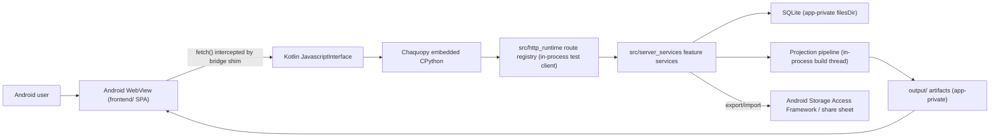

# Android Mobile Enhancement Implementation Plan

Generated: 2026-07-02
Status: Proposed (implementation plan — no code changes yet)

## 1. Goal

Enable the Retirement Planning v10 system to run natively on an Android mobile
phone as an installable app, preserving the core product promise: **all
sensitive plan data stays local on the device**, with the full guided
workflow, projection engine, and in-app results browsing available offline.

## 2. Why the Current Architecture Is a Good Starting Point

The v10 codebase is unusually well positioned for an Android port. An audit of
the current system shows:

| Property | Current state | Android impact |
|---|---|---|
| Web framework | None — dependency-free stdlib route registry (`src/http_runtime/`) | Runs anywhere CPython runs; no Flask/Werkzeug porting needed |
| UI | No-build-step SPA (`frontend/index.html` + plain JS/CSS) | Loads directly in an Android WebView, exactly as it loads in PyWebView today |
| Desktop bridge | `frontend/js/pywebview_bridge.js` intercepts `fetch('/api/...')` and routes it in-process through `src/desktop_api.py` — no socket | The identical pattern works with an Android WebView `JavascriptInterface`; the bridge shim needs only a second transport branch |
| Persistence | SQLite (`local_state/retirement_system_v10.db`) + CSV adapters (`input/`) | SQLite is native on Android; CSV/JSON/YAML adapters are plain file I/O |
| Python dependencies | `numpy`, `openpyxl`, `reportlab`, `matplotlib`, `pillow`, `cryptography`, `pywebview` | All except `pywebview` are available on Android via Chaquopy (numpy/matplotlib/pillow/cryptography as prebuilt wheels; openpyxl/reportlab are pure Python). `pywebview` is desktop-only and is *replaced* by the native WebView shell |
| Auth/network | Local-only mode, no external services required (pricing providers optional) | Offline-first works out of the box |

The two genuine architectural obstacles are:

1. **Subprocess-based workbook builds.** `/api/build/start` spawns
   `tools/build_workbook.py` via `subprocess.Popen([sys.executable, ...])`
   (`src/server_services/build_job_service.py:301`,
   `src/server/workbook_routes.py:304`). Android apps cannot spawn a second
   CPython process; builds must run in-process (thread) on Android.
2. **Desktop-first UI.** The SPA has a viewport meta tag and some `@media`
   rules, but the primary responsive breakpoint is 1180px and the layout is a
   three-column grid (310px nav / content / 370px help). Dense tables
   (`lot-table`, `matrix-table` with `min-width: 850px`) and hover-oriented
   controls need a real phone-width (≤480px) design pass.

Everything else — Windows launchers (`launchers/*.bat`), OneDrive backup
(`tools/backup_to_onedrive.py`), PyInstaller frozen-exe path handling
(`sys._MEIPASS`, `BASE_DIR` in `app_core.py`) — is desktop packaging concern
that simply must not be *assumed* by shared code paths.

## 3. Approach Options Considered

| Option | Description | Verdict |
|---|---|---|
| **A. Native Android shell + embedded Python (Chaquopy)** | Kotlin app hosting a WebView; Chaquopy embeds CPython + the `src/` tree; a Kotlin↔JS bridge replays the existing `pywebview_bridge.js` pattern | **Recommended.** Maximum code reuse (~95% of Python and 100% of frontend), true offline local-only app, installable APK |
| B. Termux + server mode | Run `python main.py --mode server` under Termux, open Chrome at `127.0.0.1:5050` | Not a product, but the **zero-code validation path** — used in Phase 1 to test the responsive UI on real hardware before any Android code exists |
| C. Remote/home server + phone browser (PWA) | Host server mode on a PC; phone is a thin client | Rejected as the primary path: violates the local-only privacy goal, requires the desktop to be on, and needs auth/TLS hardening the local-only build deliberately removed |
| D. Kivy / BeeWare rewrite | Rebuild the UI in a Python-native mobile toolkit | Rejected: discards the entire mature SPA frontend and its test coverage for no benefit |
| E. Full native rewrite (Kotlin/Compose) | Reimplement engine + UI | Rejected: months of effort, duplicate projection engine, permanent double maintenance |

**Recommendation: Option A**, with Option B used as the cheap validation
harness during the responsive-UI phase.

## 4. Target Architecture (Option A)

Key decisions:

- **Same route registry, third transport.** Desktop mode calls the registry
  through `DesktopApi.request()`; server mode through the stdlib HTTP server.
  Android adds a third transport: Kotlin `JavascriptInterface` →
  Chaquopy → a thin `src/android_api.py` mirroring `src/desktop_api.py`.
  No route or service code changes per-platform.
- **App-private storage as workspace root.** `input/`, `output/`,
  `local_state/`, `saved_plans/` live under Android `filesDir`. A new
  workspace-root resolver (Phase 0) replaces scattered `BASE_DIR` /
  `sys._MEIPASS` logic.
- **In-process builds.** A `BuildRunner` abstraction with two
  implementations: `SubprocessBuildRunner` (desktop, current behavior) and
  `InProcessBuildRunner` (thread invoking the same build entry function).
  Progress reporting already flows through the in-memory job state used by
  `build_job_service.py`, so the frontend polling UX is unchanged.
- **File exchange via SAF/share sheet.** The bridge's existing `_binary` →
  Blob download path gets an Android branch: workbook/PDF/`.rpx` downloads
  route to the Android share sheet or `Downloads/` via
  `ACTION_CREATE_DOCUMENT`; CSV/`.rpx` imports use `ACTION_OPEN_DOCUMENT`.

## 5. Implementation Phases

### Phase 0 — Cross-platform groundwork (desktop-safe refactors)

Pure-Python refactors that land on `main` first, keep all 550 tests green, and
benefit the desktop build too.

| # | Task | Files touched |
|---|---|---|
| 0.1 | Introduce `src/platform_runtime.py`: single resolver for workspace root, writable dirs (`input/`, `output/`, `local_state/`, `saved_plans/`), and platform capabilities (`can_subprocess`, `can_open_browser`, `is_mobile`). Honors a `RETIREMENT_SYSTEM_WORKSPACE_ROOT` env var so Android can point it at `filesDir` | new module; `src/server/app_core.py`, `src/runtime_config.py` |
| 0.2 | Extract the workbook build entry so it is callable as a function (`run_build(options) -> BuildResult`) as well as a script; `tools/build_workbook.py` becomes a thin CLI wrapper | `tools/build_workbook.py`, new `src/build_entry.py` |
| 0.3 | Add `BuildRunner` abstraction with `SubprocessBuildRunner` (default, current behavior) and `InProcessBuildRunner` (threaded, selected by capability flag); wire both sync (`workbook_routes.py:304`) and async (`build_job_service.py:301`) paths through it | `src/server_services/build_job_service.py`, `src/server/workbook_routes.py` |
| 0.4 | Guard desktop-only behaviors behind capability flags: `webbrowser.open`, OneDrive backup, desktop exit-snapshot semantics, launcher-relative paths | `main.py`, `src/desktop_api.py`, `src/local_backup_scheduler.py` |
| 0.5 | Make `pywebview` an optional import everywhere (it already is in `desktop_app.py`; verify no other hard imports) and move it to an extras/desktop requirements group | `requirements.txt`, packaging docs |
| 0.6 | Add pytest coverage: in-process build produces identical artifacts to subprocess build (golden-master comparison); workspace-root override respected by all file I/O helpers | `tests/` |

Exit criteria: full suite green; desktop exe rebuilt and behavior unchanged;
`RETIREMENT_SYSTEM_WORKSPACE_ROOT=/tmp/x python main.py --mode server` runs a
complete plan→build→download cycle from the overridden root.

### Phase 1 — Mobile-responsive frontend

All work in `frontend/`; no Android code yet. Validate continuously on a real
phone using Option B (server mode on LAN, or Termux) plus Chrome DevTools
device emulation.

| # | Task | Notes |
|---|---|---|
| 1.1 | Add phone breakpoints (≤480px, ≤768px) to `dashboard.css`; collapse the 3-column grid to a single column with the left step nav becoming a slide-in drawer (hamburger) and the help pane becoming a bottom sheet / collapsible section | The 1180px breakpoint already stacks columns; this extends it down to phone widths |
| 1.2 | Touch ergonomics: minimum 44px tap targets for `.btn`, `.stepbtn`, `.helpbtn`; replace hover-only affordances; increase base font sizing on small screens | |
| 1.3 | Table strategy for `lot-table`, `matrix-table`, `change-table`: keep horizontal scroll with sticky first column (already partially present) as the baseline; convert the highest-traffic tables (holdings, spending budget lines) to stacked card layout under 480px | Highest-effort UI item |
| 1.4 | Mobile navigation flow: persistent bottom bar with Back/Next (replacing `.nav-actions` row), progress indicator in the header | |
| 1.5 | Charts/Results Explorer: verify `detail-chart-grid` and the workbook results views reflow at phone widths; the in-app Results Explorer is the primary results surface on mobile (users will not open the XLSX on a phone) | |
| 1.6 | File pickers: ensure `<input type="file">` flows (YTD CSV import, plan import) work with Android's document picker in a plain browser | |
| 1.7 | Regression guard: add viewport-width smoke tests to the JS/route test coverage where feasible; document a manual phone test checklist in `documentation/` | |

Exit criteria: complete guided workflow (enter plan data → build → browse
results → export) is usable on a 390×844 viewport in mobile Chrome against
server mode, with no horizontal viewport overflow outside intentional
scroll containers.

### Phase 2 — Android app shell (Chaquopy + WebView)

New `android/` directory containing a Gradle/Kotlin project. The Python `src/`
tree and `frontend/` are packaged into the APK via Chaquopy's `sourceSets`.

| # | Task | Notes |
|---|---|---|
| 2.1 | Scaffold Android project: single-activity Kotlin app, WebView with JS enabled, `WebViewAssetLoader` serving `frontend/` from app assets | minSdk 26+, targetSdk current |
| 2.2 | Chaquopy integration: pin Python 3.11 (or the version matching desktop), declare pip deps (`numpy`, `openpyxl`, `reportlab`, `matplotlib`, `pillow`, `cryptography`) in `build.gradle`; set matplotlib `Agg` backend via env | `pywebview` excluded on Android |
| 2.3 | `src/android_api.py`: mirror of `src/desktop_api.py` — takes method/path/body/headers, calls the in-process route-registry test client, returns status/headers/body (base64 for binary) | ~100 lines, mostly copied |
| 2.4 | Kotlin `JavascriptInterface` bridge: `request(json) -> json` calling `android_api.py` through Chaquopy on a background executor; startup sets `RETIREMENT_SYSTEM_WORKSPACE_ROOT` to `context.filesDir` and seeds `reference_data/`, blank `input/` templates, and `system_config.csv` on first run | |
| 2.5 | Extend `frontend/js/pywebview_bridge.js` (or a sibling `android_bridge.js`) with the Android transport branch: detect `window.AndroidBridge`, route intercepted `fetch()` calls through it; keep the existing `_binary`→Blob logic for in-WebView rendering | The interception logic is already transport-agnostic |
| 2.6 | Downloads/exports: bridge `_binary` responses to Kotlin, write via `ACTION_CREATE_DOCUMENT` or MediaStore `Downloads/`; share sheet for `.rpx`/PDF/XLSX | |
| 2.7 | Imports: `ACTION_OPEN_DOCUMENT` for YTD CSVs and saved-plan `.rpx`, handed to the existing import routes | |
| 2.8 | Build execution: capability flag selects `InProcessBuildRunner`; long builds run in a foreground service (or `WorkManager` expedited job) so Android does not kill the process mid-build; existing progress-poll UI works unchanged | |
| 2.9 | Lifecycle: flush/`wal_checkpoint` SQLite on `onStop`; reuse the exit-snapshot pattern (`/api/plan/exit-snapshot`) on app background | |

Exit criteria: debug APK on a physical device completes the full golden-path
workflow offline: first-run seeding → plan entry → workbook build →
Results Explorer browsing → export XLSX/PDF via share sheet → save/load
`.rpx` plan.

### Phase 3 — Hardening, performance, packaging

| # | Task | Notes |
|---|---|---|
| 3.1 | Performance pass: profile deterministic projection + Monte Carlo on mid-range ARM hardware; expose a mobile default for `mc_paths` in `system_config.csv` if needed; verify `vectorized_fast_core.py` numpy paths are the ones exercised | |
| 3.2 | APK size: measure (numpy+matplotlib will dominate, expect 80–150 MB installed); use ABI splits (arm64-v8a primary), strip matplotlib data files not used by the report pipeline | |
| 3.3 | Memory: workbook build + reportlab PDF on a 4–6 GB device; stream/chunk where the desktop code buffers whole artifacts | |
| 3.4 | Security review: WebView hardening (no remote URLs, `file://` disabled in favor of asset loader, JS interface exposed only to bundled origin); confirm SQLite/`.rpx` live only in app-private storage; document Android backup (`allowBackup`/`dataExtractionRules`) policy for sensitive plan data | Local-only promise must survive the port |
| 3.5 | CI: GitHub Actions workflow building the debug APK on every PR touching `src/`, `frontend/`, or `android/`; pytest suite already covers the shared Python | |
| 3.6 | Instrumented smoke test: Espresso/UIAutomator script driving first-run → build → export on an emulator in CI | |
| 3.7 | Distribution: start with sideloaded/internal-testing APK for the household user; Play Store internal track later if desired | Signing config, versioning tied to `src/version.py` |

### Phase 4 — Optional follow-ons (out of initial scope)

- **Desktop↔phone plan sync** via `.rpx` export/import (share sheet → email/
  Drive → desktop import). No server component; keeps local-only model.
- **PWA fallback** for iOS/other platforms once the responsive frontend from
  Phase 1 exists (requires the user to run server mode somewhere).
- **Biometric app lock** (BiometricPrompt) gating app open, given the
  sensitivity of plan data on a pocketable device.

## 6. Effort and Sequencing Estimate

| Phase | Scope | Rough effort |
|---|---|---|
| 0 | Cross-platform groundwork | 1–2 weeks |
| 1 | Responsive frontend | 2–3 weeks (tables dominate) |
| 2 | Android shell | 2–3 weeks |
| 3 | Hardening/CI/packaging | 1–2 weeks |
| **Total** | | **6–10 weeks** |

Phases 0 and 1 are independently valuable (cleaner desktop code, usable
browser UI on any phone/tablet via server mode) and de-risk Phase 2 almost
entirely: by the time Android code is written, the only new surface is the
Kotlin shell and bridge transport.

## 7. Risks and Mitigations

| Risk | Likelihood | Mitigation |
|---|---|---|
| Chaquopy wheel gaps or version pin conflicts (numpy/matplotlib/cryptography) | Low–Med | Spike task at Phase 2 start: minimal Chaquopy app importing every dependency and running one projection; pin versions to Chaquopy's supported matrix |
| Workbook/PDF build too slow or memory-heavy on phones | Med | Phase 3.1/3.3 profiling; mobile Monte Carlo defaults; builds are user-initiated and progress-reported, so 1–2 min is acceptable |
| Table-dense screens never feel good on a phone | Med | Phase 1.3 card layouts for the top screens; accept scroll containers for advanced matrices — the phone's primary jobs are data entry, review, and reading results, not bulk matrix editing |
| Subprocess-removal regression on desktop | Low | `BuildRunner` keeps the subprocess path as the desktop default; golden-master artifact comparison test in Phase 0.6 |
| APK size deters install | Low | Single-user household app, sideloaded; ABI splits keep it manageable |
| Android kills the app mid-build | Med | Foreground service for builds (2.8); SQLite WAL checkpoint on lifecycle events (2.9) |

## 8. Acceptance Criteria (Definition of Done for the initial release)

1. Installable arm64 APK runs fully offline on Android 8+ (API 26+).
2. Complete guided workflow on-device: plan data entry, spending import,
   strategy, workbook build, Results Explorer, PDF/XLSX export via share
   sheet, `.rpx` save/load.
3. All existing pytest coverage (550 tests) passes unchanged on desktop; new
   tests cover the workspace-root resolver, `BuildRunner` parity, and the
   Android API adapter.
4. Desktop packaging (`python build.py` / PyInstaller) is byte-for-byte
   unaffected in behavior.
5. Plan data never leaves app-private storage except through explicit
   user-initiated export.

## 9. Immediate Next Actions

1. Approve this plan (or select a different option from §3).
2. Land Phase 0.1–0.3 (`platform_runtime.py`, callable build entry,
   `BuildRunner`) as the first PR — desktop-safe, fully testable.
3. Run the Chaquopy dependency spike (§7, risk 1) in parallel to Phase 1 so
   any wheel-availability surprises surface before Android shell work begins.
