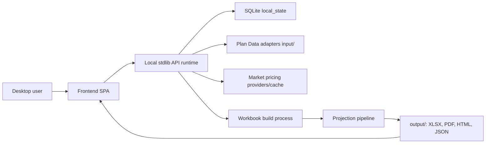
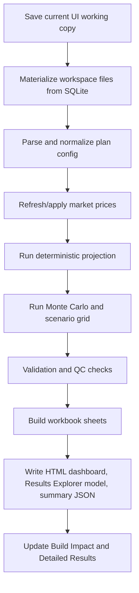
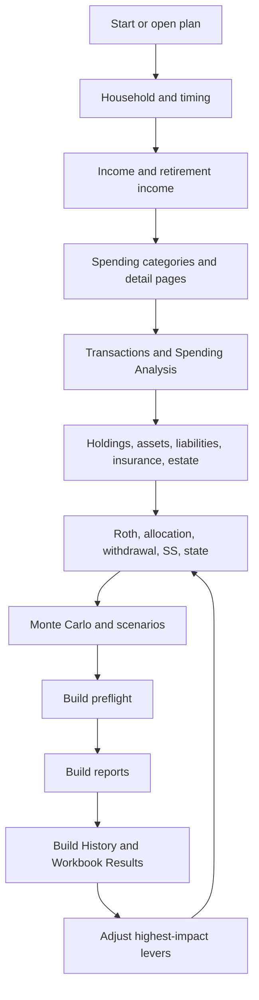

# Retirement Planning v10 Current System Design Spec

Generated: 2026-06-26

## 1. Purpose

Retirement Planning v10 is a local-only desktop retirement planning system. It combines structured household plan data, investment holdings, spending actuals, market pricing, deterministic projection logic, Monte Carlo and scenario analysis, and advisor-ready reporting into one guided workflow.

The current system is designed for a single local user and a single active local plan. The local SQLite database is the operational source of truth. CSV, JSON, and YAML files remain as import/export adapters and portable Plan Data artifacts.

## 2. Product Goals

- Give a household or advisor a complete, auditable retirement plan.
- Keep all sensitive plan data local by default.
- Support guided entry for household, income, spending, assets, insurance, estate, strategy, stress tests, and settings.
- Rebuild a complete workbook/PDF/report package from the saved plan snapshot.
- Provide in-app browsing of workbook results so users do not need to open Excel for every review.
- Connect actual year-to-date spending and account data back to long-term retirement assumptions.
- Preserve advisor-grade transparency through quality-control checks, source citations, assumptions, methodology, and build fingerprints.

## 3. Primary Personas

- Household user: maintains plan inputs, imports spending transactions, reviews projections, and downloads reports.
- Advisor/power user: validates assumptions, edits advanced strategy controls, reviews detailed workbook outputs, and uses diagnostics.
- Developer/maintainer: updates projection logic, reporting sheets, test coverage, and local package behavior.

## 4. System Context

## 5. Runtime Architecture

### 5.1 Entry Points

- `main.py`: primary desktop/server entrypoint.
- `src/desktop_app.py`: desktop shell integration.
- `src/http_runtime/`: dependency-free local HTTP runtime, request/response adapter layer, route registry, test client, and stdlib server adapter.
- `src/server/app_core.py`: local route registry setup, runtime configuration, error handling, SQLite/local workspace paths, and shared helpers.
- `src/server_services/`: feature-owned, request-independent service handlers. Current migrated modules are `base_service.py`, `admin_service.py`, `build_service.py`, `build_job_service.py`, `config_service.py`, `holdings_service.py`, `plan_data_file_service.py`, `plan_file_service.py`, `plan_forms_service.py`, `portfolio_service.py`, `pricing_service.py`, `report_service.py`, `secret_service.py`, `spending_service.py`, `strategy_asset_service.py`, and `ytd_service.py`.
- `src/server/base_routes.py`: thin HTTP adapters for root UI, auth/session, preferences, runtime metadata.
- `src/server/plan_routes.py`: thin HTTP adapters for plan editing, pricing, strategy, spending, YTD, and save/load routes. Pricing, config rows/allocation preview, portfolio drift, secrets, status, housing state estimates, YTD transaction/account-setup logic, plan file save/load/snapshot semantics, spending, and strategy/assets now delegate to feature services. Remaining cleanup is focused on module ownership and route-file size.
- `src/server/workbook_routes.py`: HTTP adapters for build, downloads, detailed results, holdings, liabilities, plan-data forms, and validation routes; build preflight/summary, async build jobs, report/download/history lookup, and plan-form logic now live in services.
- `src/server/admin_routes.py`: thin HTTP adapters for local admin, system configuration, diagnostics, and reference file editing; admin business logic now lives in `admin_service.py`.
- `tools/build_workbook.py`: command-line build wrapper for workbook/report generation.
- `build.py` and `retirement_planner.spec`: PyInstaller packaging.

### 5.2 Local-Only Operating Model

The codebase has been simplified toward local desktop use:

- One active local workspace: `local`.
- One active local client/plan context.
- SQLite source of truth at `local_state/retirement_system_v10.db`.
- Plan Data adapters under `input/`.
- Generated outputs under `output/`.
- Build progress is in-memory for local sessions.
- Public-hosting and multi-client registry concerns have been removed from the local-only package.

### 5.3 Runtime Data Locations

- `system_config.csv`: system/runtime settings, pricing configuration, build flags, and shared assumptions.
- `local_state/`: SQLite database and local runtime state.
- `input/`: canonical Plan Data files and `plan_data_manifest.json`.
- `reference_data/`: schema and tax/reference assumptions.
- `output/`: generated workbook, PDF, HTML dashboard, Results Explorer model, plan summary, and diagnostics.
- `saved_plans/`: user plan snapshots.
- `data/`: desktop preferences and webview profile data.

### 5.6 Flask-Free Local Runtime

The packaged app now runs without Flask/Werkzeug/Jinja.  The local JSON API uses `src/http_runtime`, a dependency-free stdlib runtime that preserves existing `/api/...`, `/frontend/...`, and download paths while route/business logic is extracted into feature services.

Implemented pieces:

- `src/http_runtime/wsgi_facade.py`: narrow local HTTP facade for the existing decorators, request-local object, JSON/file responses, route matching, app hooks, and in-process test client.
- `src/http_runtime/server.py`: `ThreadingHTTPServer` adapter for browser/server mode.
- Desktop mode routes pywebview bridge calls through the same local route registry without opening a socket.
- `requirements.txt` and `retirement_planner.spec` no longer include Flask, Werkzeug, Jinja, Click, ItsDangerous, MarkupSafe, or Waitress.

Physical service extraction is now broad enough that route modules are mostly HTTP adapters. Base/runtime, admin/config/reference, build preflight/summary, config rows/allocation preview, SQLite Plan Data forms, pricing diagnostics/jobs, holdings/liabilities, YTD, plan-data files, saved-plan/snapshot behavior, report/download/history lookup, async build job orchestration, spending, strategy/assets, portfolio drift, and secret-setting behavior live under `src/server_services`. Remaining cleanup is architectural, not a runtime blocker: retire adapter facade names and service-extract the synchronous `/api/build` adapter after parity tests confirm no active callers need the old code path.

## 6. Frontend Design

### 6.1 Shell

The browser UI is a single-page application served from `frontend/index.html` with behavior in:

- `frontend/js/dashboard.js`: main workflow, navigation, plan editing, build/download flow, detailed results, and most feature-specific rendering.
- `frontend/js/spending_dashboard.js`: Spending Analysis dashboard.
- `frontend/js/dashboard_utils.js`: shared dashboard helpers.
- `frontend/js/pywebview_bridge.js`: desktop bridge behavior.

### 6.2 Navigation Model

The frontend defines a guided step list grouped as:

- Plan Data
- Spending
- Other Assets & Liabilities
- Strategy
- Stress Tests
- Reports
- Settings

The step list is searchable and grouped in the left navigation. Each step has a title, description, intro, and contextual help. The current step is tracked by `activeStep`. Some optional steps are shown only when an optional module is enabled.

### 6.3 Current Step Inventory

Plan Data:

- Start
- Household people
- Retirement timing
- Work income
- Social Security & Retirement Income

Spending:

- Spending Categories
- Wellness
- Housing
- Travel
- Large Discretionary
- Income & Expense Transactions

Other Assets & Liabilities:

- Investment holdings
- Cash reserves
- Annuity death benefits
- Insurance & LTC policies
- Other
- Estate inputs

Strategy:

- Planning Levers & Strategy Hub
- Roth conversion
- Asset allocation & location
- Allocation policy settings
- Withdrawal sequencing
- Social Security timing
- State residency
- HELOC strategy
- Entity & charitable giving

Stress Tests:

- Monte Carlo
- Scenarios
- Survivor / early death
- Long-term care
- Divorce / QDRO stress

Reports:

- Spending Analysis
- Download Reports
- Build History
- Retirement Plan Workbook
- Plan Data Summary

Settings:

- Economic & tax assumptions
- Optional modules
- All assumptions
- System Configuration

### 6.4 UI State and Editing Model

- Plan rows are loaded from `/api/config/rows`.
- Dirty field edits are tracked client-side before save.
- Several specialized pages maintain their own dirty flags: holdings, liabilities, travel extras, liquidity buffers, forced conversions, YTD transactions, spending category maps, taxonomy budgets, and rules.
- Navigation is guarded when unsaved changes exist.
- Some sections auto-save on navigation, especially spending/YTD workflow pages.
- Build actions save the working copy before running the projection/report generation.
- Build status is tracked with progress overlay, polling, and fallback behavior.

### 6.5 Detailed Results UI

The in-app workbook browser reads from `/api/detailed-results`, backed by `output/results_explorer_model.json` when available. It supports:

- Workbook sheet navigation grouped by result category.
- Chart-dashboard pages.
- Table sections.
- Search within results.
- Collapsible column groups.
- Stale-results warnings when plan inputs changed after the last build.

## 7. API Design

### 7.1 Route Families

Base/runtime:

- `/`, `/frontend`, `/frontend/<path>`
- `/api/ping`
- `/api/runtime`
- `/api/prefs`
- `/api/auth/session`, `/api/auth/login`, `/api/auth/logout`

Plan/config:

- `/api/status`
- `/api/config/backends`
- `/api/config/rows`
- `/api/config/sync`
- `/api/plan`
- `/api/plan/forms`
- `/api/plan/forms/<section_path>`
- `/api/plan/save-as`
- `/api/plan/load-file`
- `/api/plan/exit-snapshot`
- `/api/plan-data/files`
- `/api/plan-data/blank`
- `/api/plan-data/<file_name>`

Build/results/downloads:

- `/api/build/start`
- `/api/build/progress/<job_id>`
- `/api/build/events/<job_id>`
- `/api/build/status`
- `/api/build`
- `/api/summary`
- `/api/detailed-results`
- `/api/xlsx`
- `/api/pdf`
- `/api/schema`
- `/api/history`
- `/files/<filename>`

Investments/pricing:

- `/api/prices/refresh`
- `/api/prices/test-symbol`
- `/api/prices/test-symbol/start`
- `/api/prices/test-symbol/status/<job_id>`
- `/api/prices/snapshots`
- `/api/portfolio/drift`
- `/api/holdings`
- `/api/liabilities`
- `/api/secrets`

Planning strategy and assets:

- `/api/allocation-preview`
- `/api/large-discretionary-expenses`
- `/api/forced-roth-conversions`
- `/api/liquidity-buffers`
- `/api/other-asset/add`
- `/api/other-asset/delete`
- `/api/education-529/add`
- `/api/estate-state-options`
- `/api/estate-state/add`
- `/api/trust-account/add`
- `/api/insurance-policy/add`
- `/api/insurance-policy/delete`
- `/api/capital-market/assumptions`
- `/api/capital-market/correlations`
- `/api/housing/seed`
- `/api/housing/state-estimate`
- `/api/wellness/seed`

YTD and spending:

- `/api/ytd/status`
- `/api/ytd/account-setup`
- `/api/ytd/account-setup/recover`
- `/api/ytd/transactions/template`
- `/api/ytd/transactions/upload`
- `/api/ytd/transactions`
- `/api/ytd/transactions/<index>`
- `/api/ytd/transactions/bulk`
- `/api/spending/dashboard`
- `/api/spending/model`
- `/api/spending/summary`
- `/api/spending/taxonomy`
- `/api/spending/category`
- `/api/spending/category/<cat_id>`
- `/api/spending/category/<cat_id>/restore`
- `/api/spending/restore-template`
- `/api/spending/hide-unused-templates`
- `/api/spending/alias`
- `/api/spending/aliases`
- `/api/spending/rules`
- `/api/spending/rules/save`
- `/api/spending/budget`
- `/api/spending/budget/seed`
- `/api/spending/budget/load-actuals`
- `/api/spending/budget/taxonomy`
- `/api/spending/budget/taxonomy/save`
- `/api/spending/budget/recover`
- `/api/spending/budget-lines`
- `/api/spending/budget-lines/defaults`

Admin/system:

- `/admin`, `/system-configuration`
- `/api/admin/system-config`
- `/api/admin/reference-files`
- `/api/admin/reference-files/<file_name>`
- `/api/admin/tax-law-dashboard`
- `/api/admin/diagnostics`
- `/api/admin/server`
- `/api/admin/mode`
- `/api/admin/server/shutdown`
- Multi-client registry/admin browsing routes are not included in the local-only package.

### 7.2 API Response Pattern

The API generally returns JSON with `success`, data payloads, and `error` when applicable. The app-level error handler converts unexpected API failures into JSON so the frontend does not display raw framework/server HTML.

## 8. Data Model

### 8.1 Plan Row Schema

Most plan facts use a six-column logical row:

- `section`
- `subsection`
- `label`
- `value`
- `units`
- `notes`

This structure is used across CSV adapters, SQLite `settings`, schema validation, UI rendering, and reporting inputs.

### 8.2 SQLite Tables

The SQLite store is initialized by `src/config_backend.py`. Core tables include:

- `settings`: source-of-truth structured plan rows.
- `client_files`: file-style artifacts such as holdings, liabilities, YTD, and adapter content.
- `audit_events`: local audit trail.
- `build_jobs`: local build job records.
- `price_snapshots`: cached and historical market pricing.

Additional local tables may be created by spending/YTD modules as needed.

### 8.3 Adapter Files

CSV/JSON/YAML are portable adapters. The app can import/export:

- household data
- income data
- spending data
- assets
- policy/configuration
- insurance/estate
- optional functions
- optimizer controls
- holdings
- target allocation

`input/plan_data_manifest.json` records file hashes and sizes for current Plan Data sync checks.

## 9. Projection and Planning Engine

### 9.1 Build Pipeline

### 9.2 Projection Stage Contract

The facade in `src/projection_pipeline.py` defines the current stage order:

- DeathTransition
- AssetAppreciation
- EarnedIncome
- PayrollTax
- Contributions
- SocialSecurity
- AnnuityIncome
- Spending
- RMDs
- RothConversion
- TaxAssessment
- WithdrawalCascade
- Growth
- NetWorth

The deterministic engine remains the oracle. The stage facade emits scheduled/completed events and stage summaries, allowing future stage-by-stage decomposition without breaking callers.

### 9.3 Major Planning Domains

- Household timing and survivor state.
- Earned income, payroll tax, retirement contributions.
- Social Security, pensions, annuities, and survivor continuation.
- Spending by recurring categories, housing, wellness, travel, and large discretionary events.
- Federal, state, NIIT, IRMAA, payroll, and capital gains tax modeling.
- Roth conversion policies, forced conversions, bracket fill, and IRMAA guardrails.
- RMDs and withdrawal sequencing.
- Asset allocation, location, drift, and optimizer controls.
- Tax-aware portfolio and lot data.
- Estate, insurance, LTC, survivor, divorce, HELOC, and scenario overlays.
- Monte Carlo simulation and sensitivity grid.

## 10. Reporting Outputs

### 10.1 Workbook

`src/reporting/workbook_builder.py` creates `output/retirement_plan.xlsx`.

Current sheet families:

- Summary sheets: executive summary, assumptions, balance sheet, asset allocation.
- Projection sheets: net worth, cash flow, lifetime tax, charts dashboard.
- Strategy sheets: retirement strategy, Social Security, Roth conversion, charitable giving, state residency, estate plan, planning levers.
- Stress sheets: Monte Carlo, scenario analysis, LTC stress, survivor stress, life insurance, RMD audit.
- Reference/QC sheets: quality control, glossary, methodology, account reconciliation, workbook warnings.
- Spending sheets: core spending breakdown and taxonomy-aware spending summary.

### 10.2 PDF

The enterprise PDF builder generates advisor-facing summary output from the same projection/report artifacts.

### 10.3 Offline HTML Dashboard

The reporting dashboard builder writes `output/retirement_dashboard.html` from the workbook path, projection rows, and normalized config.

### 10.4 Results Explorer Model

`src/results_model.py` writes `output/results_explorer_model.json`. The frontend consumes this semantic sidecar instead of reverse-engineering Excel formatting where possible.

### 10.5 Summary and Diagnostics

- `output/plan_summary.json`: build success, key KPIs, and QC status.
- `output/pricing_diagnostics.json`: provider status and ticker-level pricing detail.
- `output/build_snapshot.json`: versioned build sidecar containing build ID, code version, input fingerprint, system-config hash metadata, pricing diagnostics hash metadata, output artifact hashes, and copied summary KPIs.
- Build progress/events endpoints expose status during local runs.

## 11. Spending and YTD Design

### 11.1 Spending Category Model

The current spending design centers on a canonical hierarchy:

- Tracking Type
- Group
- Category
- Aliases/rules
- Budget references

Housing, Wellness, and Travel have dedicated authoritative pages. Spending Categories acts as the comprehensive category manager and model-control page. Within Wellness, the Healthcare Premium group contains Pre-65 Healthcare Premium and Medicare Part B, Part D, and Part G/Medigap premiums. The Annual Household Medical OOP Cap is a cap/reference for non-premium medical spending, not a standalone expense budget. Travel rows are normalized into the Travel group rather than a separate travel-detail group.

### 11.2 YTD Transactions

The YTD workflow supports CSV upload, add/replace/deduplicate modes, inline editing, account/source setup, and actual-vs-budget rollups. It feeds Spending Analysis and helps align real spending with the long-term retirement model.

### 11.3 Spending Analysis

Spending Analysis combines:

- actual vs budget
- annualized run rate
- income and expense transaction summaries
- portfolio growth versus prior-year balances
- sync loop back to the 30-year spending model

## 12. Market Pricing and Holdings

Holdings are represented by tax lots. Pricing can use configured providers and cached snapshots. Supported concepts include:

- ticker, account, shares, purchase date, cost basis
- CASH at price 1.00
- provider fallback ordering
- price diagnostics
- account drift and allocation analysis
- tax-aware sell guidance

## 13. Security and Privacy

The packaged app is local-only, with data stored on the user's machine. Security features include:

- local session/token handling
- CSRF token usage for non-GET API calls
- optional encrypted secret storage for provider keys
- audit event helpers
- API error redaction utilities
- reverse-proxy support behind runtime flags, though the current product target is desktop/local use

Design assumption: the local machine boundary is the primary trust boundary. Any future hosted or multi-user mode should be treated as a separate product/security design.

## 14. Validation and Testing

Current validation layers include:

- schema registry validation for typed config rows
- build-time validation and QC workbook sheet
- plan-data manifest sync checks
- pricing diagnostics
- regression script at `tools/run_regression.py`
- pytest suite under `tests/`
- golden master fixtures for projection behavior
- UI responsibility and route coverage tests

## 15. Current Strengths

- Clear local-first posture and reduced deployment complexity.
- Broad planning coverage across taxes, spending, assets, insurance, estate, stress tests, and reports.
- SQLite-first storage with portable adapters is a pragmatic bridge from CSV-heavy history.
- Build process produces multiple useful output formats from one saved snapshot.
- Semantic Results Explorer model avoids fragile Excel parsing for in-app results.
- Spending/YTD integration creates a real feedback loop between actual behavior and long-term projections.
- Extensive test coverage and curated regression checks protect many previously fragile workflows.

## 16. Current Design Risks

- `frontend/js/dashboard.js` is still too large and carries many responsibilities: workflow state, rendering, data access, validation, build flow, and feature modules.
- `src/server/plan_routes.py` and `src/server/workbook_routes.py` are broad route modules with mixed concerns.
- Some older route names remain in low-level migration and recovery code, increasing naming cleanup work.
- UI save behavior is inconsistent: some pages auto-save on navigation, some require Save Changes, and some save as part of build.
- The Plan Data adapter model is powerful but can confuse users because SQLite is the source of truth while CSV files are still visible.
- Build outputs are snapshot-based, but stale-output state is not always visually dominant enough.
- Advanced settings and system configuration can expose implementation-level concepts to non-technical users.
- Desktop/local security is appropriate for now, but any future network exposure would require a separate hardening pass.

## 17. Usability Recommendations

### P0 - Highest Value

1. Add a persistent "plan state" banner.
   - Show one compact status line across the app: saved, unsaved edits, build stale, last build time, last build source, and current data source.
   - This reduces confusion around Save Changes vs Build vs Download.

2. Make the Reports group the explicit final workflow destination.
   - After completing Settings or Stress Tests, guide users to Download Reports, Build History, and Retirement Plan Workbook in that order.
   - Add a "Review and build" call-to-action to all major terminal steps.

3. Standardize save behavior.
   - Choose one model: either all editable pages auto-save on navigation, or all pages clearly stage edits until Save Changes.
   - If mixed behavior remains, display page-level save mode in the page header.

4. Add a first-run checklist.
   - Household -> Income -> Spending -> Assets -> Strategy -> Stress Tests -> Build.
   - Mark required vs optional sections.
   - Allow "skip for now" with a reason, especially for complex sections like estate, LTC, and allocation.

5. Simplify System Configuration for normal users.
   - Split into "Settings" and "Advanced maintenance". Completed in the user UI as Normal Settings and Advanced Maintenance bands, with the raw embedded console collapsed under maintenance.
   - Keep CSV import/export, reference table editing, and diagnostics behind an advanced disclosure.

### P1 - Strong Improvements

6. Add source-of-truth labels to data-heavy pages. Completed.
   - Key plan/report/spending/holdings/settings pages now show source-of-truth labels through `dashboard_source_truth_banners.js`.
   - Example: "Authoritative source: SQLite local plan. CSV export is a backup/adapter."

7. Improve "what changed" explanations after build.
   - Build History already compares KPIs. Add a natural-language summary: "Terminal net worth rose mainly because spending decreased and Roth conversions changed."
   - Link each impact back to the edited source page.

8. Add guided preflight validation before build.
   - Show missing required fields, suspicious values, stale pricing, unmapped spending, and old transaction imports before launching a long build.

9. Add page-local recommendations.
   - On Roth, allocation, spending, and Social Security pages, show 2-4 context-aware suggestions based on current values.
   - Keep recommendations explainable and link to the exact input that changes the outcome.

10. Clarify Spending flow. Completed.
   - Recommended order is shown as Categories -> Transactions -> Spending Analysis -> Sync Actual Rate -> Build.
   - Spending pages now include visible breadcrumbs and step buttons.

11. Make stale outputs harder to miss. Completed initial pass.
   - Reports pages now add an advisor-ready disabled notice when inputs changed after the last successful build.
   - Existing stale badges remain on report navigation and build preflight surfaces.

12. Add import confidence and preview. Completed.
   - Before replacing holdings or transactions, the UI now previews row counts, date range, duplicate candidates, unmapped categories/symbols, new accounts, and data-quality warnings via side-effect-free `import_preview_v1` responses.

### P2 - Polishing

13. Improve in-app workbook readability. Completed initial pass.
   - Detailed Results now adds readability controls with sheet search support and important-row jump anchors.
   - Full renderer-level sheet summaries remain an incremental workbook/report enhancement.

14. Add glossary-on-hover consistently. Completed initial pass.
   - Common acronyms and planning terms now receive hover titles across the main pane and help panel.
   - Broader workbook/PDF glossary rendering remains incremental.

15. Add "advisor mode" and "household mode" language settings.
   - Advisor mode can expose tax/strategy terminology.
   - Household mode can favor plain-English explanations and hide implementation controls.

16. Add print/PDF preview for Plan Data Summary.
   - Let the user inspect the input packet before sharing with an advisor.

## 18. Functionality Recommendations

### P0 - Highest Value

1. Create a unified plan snapshot system.
   - Capture SQLite settings, file artifacts, system config references, pricing snapshot IDs, and output fingerprints.
   - Support restore, compare, and export.

2. Formalize canonical API versions.
   - Document canonical endpoints and remove retired wrappers once internal callers are gone.
   - Removed retired spending/category-map and older budget save wrapper routes after UI parity moved to taxonomy/budget-line endpoints.

3. Add a build preflight endpoint.
   - Return validation, warnings, estimated runtime, stale pricing, missing data, and output freshness before `/api/build/start`.

4. Strengthen Results Explorer as the main report model.
   - Continue moving workbook semantics into `results_model.py`.
   - Treat Excel as one renderer, not the only canonical report source.

5. Add integration tests for complete user journeys.
   - New blank plan -> required inputs -> save -> build -> detailed results.
   - Import transactions -> map categories -> spending analysis -> sync model -> build.
   - Holdings import -> pricing refresh -> allocation recommendation -> build.

### P1 - Strong Improvements

6. Modularize frontend features.
   - Split `dashboard.js` into modules by domain: navigation, fields, build, detailed results, spending, holdings, strategy, settings.
   - Keep shared state in a small store module.

7. Modularize route files.
   - Split plan routes by feature: pricing, spending, ytd, strategy, assets, plan-data, save/load.
   - This will make route ownership and tests easier.

8. Introduce typed request/response schemas.
   - Use lightweight dataclasses or pydantic-style validation for high-value endpoints.
   - Start with build preflight, config rows, spending model, holdings, and detailed results.

9. Add output fingerprint comparison.
   - Store input fingerprint, code version, market pricing snapshot, system config hash, and generated output hashes.
   - Surface this in Build History.

10. Make market pricing mode explicit.
   - Show live/cache/fallback status in the UI before build.
   - Let the user freeze a pricing snapshot for reproducible advisor reports.

11. Expand scenario management.
   - Allow scenario templates and saved named scenario sets.
   - Add a side-by-side diff of which assumptions each scenario overrides.

### P2 - Polishing

12. Add keyboard shortcuts for power users.
   - Save, build, search steps, next step, previous step, open detailed results.

13. Add batch edit tools for assumptions. Completed.
   - Preview-first batch editors now stage All Assumptions changes and guard System Configuration edits with required filters, before/after previews, explicit confirmation, and preview CSV download.

14. Add a local backup scheduler. Completed.
   - Daily or per-build snapshots now write retention-limited `.rpx` backups and JSON manifests under `saved_plans/auto_backups`.

15. Add import/export validation reports.
   - Every import should produce a human-readable summary and machine-readable diagnostics.

## 19. Logical Flow Recommendations

### Recommended User Workflow

### Flow Improvements

1. Reorder or visually guide the left nav around dependency order.
   - Inputs that determine later pages should appear and be completed first.
   - Strategy pages should show dependency warnings if required upstream inputs are missing.

2. Put Planning Levers after the first successful build.
   - It is most useful when real baseline outputs exist.
   - Before first build, show a placeholder explaining that levers need a baseline.

3. Make Spending Analysis an iteration point, not just a report.
   - Flow should be Transactions -> Spending Analysis -> Sync Actual Rate -> Rebuild -> Build History.

4. Separate "configuration" from "plan content".
   - Economic/tax assumptions affect the model.
   - System Configuration affects runtime/build/reference behavior.
   - Users need stronger visual distinction between the two.

5. Add a guided closeout sequence.
   - Before final report: validate required inputs, refresh/freeze pricing, build, inspect QC, inspect Plan Data Summary, download workbook/PDF.

## 20. Engineering Recommendations

### Near-Term Refactor Targets

1. `frontend/js/dashboard.js`
   - Extract navigation and shell state.
   - Extract build/download flow.
   - Extract detailed results.
   - Extract domain renderers into feature modules.

2. `src/server/plan_routes.py`
   - Split into feature route modules.
   - Keep imports organized by domain.

3. Spending endpoints
   - Decide canonical route family.
   - Retired category-map/budget wrapper endpoints; maintain taxonomy, alias, budget-line, and spending-model routes.

4. Build pipeline
   - Add explicit preflight and output fingerprint objects.
   - Keep workbook builder focused on rendering, not orchestration.

5. Results model
   - Promote it to the canonical report contract.
   - Add schema version tests and sample fixtures.

### Test Strategy

Add journey tests for:

- first-run plan entry
- save/load
- build preflight
- build output freshness
- spending transaction import and category sync
- holdings import and price refresh
- detailed results model rendering
- plan snapshot restore

## 21. Suggested Roadmap

### Phase 0 - Risk Controls Already Implemented

- Root cleanup and current project manifest.
- Workbook build no longer references nonexistent optional HTML/results builders.
- Offline HTML dashboard and Results Explorer model are generated directly by the current reporting code.
- Persistent plan-state banner added to the shell.
- `/api/build/preflight` added as a fast, side-effect-free readiness check.
- `/api/build/status` upgraded to return the same richer freshness/readiness payload while preserving `current`.
- Review page includes a Build Preflight panel.
- Build flow saves the working copy, runs preflight, blocks on blockers, and asks before continuing through warnings.
- Reports navigation shows stale badges when outputs are not current.

### Phase 1 - Clarity and Flow

- Plan state banner. Completed.
- Build preflight endpoint and UI. Completed.
- Stale-output badges. Completed.
- First-run checklist. Completed.
- System Configuration simplification. Completed with a Normal Settings / Advanced Maintenance split in the user UI.

Risk controls:

- Keep all Phase 1 changes additive and reversible.
- Do not alter projection formulas, tax logic, or workbook sheet definitions.
- Prefer UI hints and preflight warnings before blocking workflows.
- Add targeted tests for every new state transition.

### Phase 2 - Canonical Contracts

- Typed API contract registry. Added dependency-free `src/api_contracts.py` and `/api/contracts` for high-value endpoint request/response schemas.

- Unified plan snapshot format. Initial output-side `build_snapshot_v1` contract implemented for generated report packages.
- Canonical API route documentation. Completed in `documentation/API_CONTRACTS.md` for config rows, spending model, YTD transactions, holdings, build preflight/start, detailed results, and plan exit snapshots.
- Results Explorer schema fixtures. Completed with `tests/fixtures/results_model_v10_contract.json` and contract tests for generated semantic model/index/sheet helpers.
- Output fingerprints. Initial artifact SHA-256 fingerprints are written beside every successful workbook/dashboard/model build, exposed by build preflight, and shown in Build History.
- Pricing snapshot freeze. Initial freeze/unfreeze contract and UI controls implemented with `pricing_snapshot_freeze_v1`; builds now use frozen per-symbol prices until unfrozen.

Risk controls:

- Version every new contract.
- Keep Plan Data CSV adapters while avoiding obsolete route names.
- Add schema fixtures before switching consumers.
- Store fingerprints alongside outputs without changing the output formats first.

### Phase 3 - Modularization

- Split `dashboard.js`. Initial Phase 3 ownership seams completed with `dashboard_source_truth_banners.js` and `frontend/js/modules/phase3_module_manifest.js`; full physical extraction remains incremental.
- Split route modules. Initial `src/server/route_manifest.py` ownership registry and feature seams added while preserving existing route registrations. Flask/Werkzeug dependency removal is implemented through `src/http_runtime`; physical service extraction has started with `src/server_services/base_service.py`, `admin_service.py`, `build_service.py`, and `plan_forms_service.py`.
- Consolidate spending routes. Retired spending wrappers have been removed; taxonomy, alias, spending-model, and budget-line endpoints are the active route family.
- Move build orchestration out of workbook rendering where practical. Build snapshot database capture was extracted into `src/build_snapshot.py`; the runtime transport is now stdlib-only; broader orchestration extraction remains future work.

Risk controls:

- Extract modules without changing public function names first.
- Keep route registrations identical until tests prove parity.
- Remove route wrappers only after UI/tests prove the replacement route family covers the workflow.
- Run `tools/run_regression.py` after each extraction batch.

### Phase 4 - Advisor-Grade Enhancements

- Natural-language build impact summary. Natural-language Build Impact summary with source-page links completed for the latest session build; it summarizes PTI/TNW/tax/risk/Roth deltas and links captured edits back to their source workflow pages.
- Scenario templates and saved scenario sets. Completed as local Scenarios-page templates, browser-local named scenario sets, and side-by-side diff previews before applying overrides.
- Recommendation engine for Roth/allocation/spending/SS. Initial explainable `page_recommendations_v1` UI implemented for Roth conversion, allocation, core spending, and Social Security pages, then expanded to state residency and withdrawal sequencing; suggestions are non-automatic and link back to source inputs.
- Advisor vs household language mode. Implemented as a browser-local display-only preference, then **removed on 2026-07-15** — it only swapped a handful of words and carried an inert body attribute, so the feature was retired and page copy now renders as authored.
- Automated local backup retention. Completed as opt-in opportunistic `.rpx` SQLite backups with daily/per-build cadence, manual run control, JSON manifests, and capped retention under `saved_plans/auto_backups`.
- Canonical advisor report package. Completed with `report_package_v1`, written beside every successful build as `output/report_package.json`, exposed through `/api/report-package`, and surfaced in build preflight artifact metadata. The package treats Excel, PDF, and HTML as renderers while preserving `results_model_v10` as the semantic report model and `build_snapshot_v1` as the reproducibility snapshot.

Risk controls:

- Treat recommendations as explainable suggestions, not automatic plan changes.
- Add source links from every recommendation back to editable fields.
- Advisor/household language mode was display-only (never logic branching) and has since been removed entirely.
- Backup retention remains opt-in; snapshot restore now uses build-snapshot database copies with hash validation and pre-restore backups.
- Batch edit tools remain preview-first and do not automatically build; plan edits are staged until Save Changes, while System Configuration edits require a field filter and explicit write confirmation.

### Comprehensive Low-Risk Implementation Backlog

P0:

- Finish first-run checklist with required/optional skips and a Review-and-Build destination. Completed with page-level save-mode labels, Review-and-Build closeout sequencing, Plan Data Summary print/PDF preview controls, and Planning Levers baseline gating. Deeper optional-policy analytics remain an enhancement, not a Phase 1 blocker.
- Add build preflight tests for missing outputs, stale outputs, schema errors, and pricing warnings. Initial contract tests completed for current, missing output, missing required, and schema-error states.
- Add a snapshot object containing SQLite hash, Plan Data manifest hash, system config hash, pricing diagnostics hash, output hashes, build ID, and code version. Completed in `build_snapshot_v1` with active SQLite metadata and immutable `plan_database_snapshot.rpx`; restore/compare routes are now available.
- Show output fingerprint and pricing mode in Build History. Completed for the session Build History surface with input/workbook/results hashes plus pricing mode/status chips.
- Split System Configuration into Normal Settings and Advanced Maintenance UI groups. Completed.

P1:

- Define canonical endpoint docs for config rows, spending model, YTD transactions, holdings, build preflight, build start, detailed results, and plan snapshot. Completed in `documentation/API_CONTRACTS.md`.
- Add `results_model_v10` fixture tests and treat Results Explorer as the canonical report contract. Completed with a stable fixture summary and semantic helper contract tests.
- Add journey tests for first-run build, transactions-to-spending-sync, holdings-to-allocation, and snapshot restore. Completed Phase 2 live route-dispatch coverage for build preflight/start/progress/events, Detailed Results route parsing, YTD-to-spending canonical routes, holdings-to-allocation preview, and build-snapshot compare/restore. Static/non-destructive journey guards remain as lightweight source-surface checks.
- Extract frontend modules in this order: plan state/build flow, detailed results, navigation, spending, holdings, strategy, settings. Initial manifest and additive roadmap module completed; physical extraction is now underway with `api_client.js`, `app_store.js`, `navigation.js`, `reports_ui.js`, and `planning_workbench_ui.js`; remaining work is to move more sheet/table helpers, spending/holdings renderers, and build orchestration out of `dashboard.js`.
- Split server routes in this order: build/results, plan data, pricing, spending, YTD, strategy/assets, admin. Initial route ownership manifest and feature seams completed; decorator movement remains incremental. YTD, local plan-file handlers, async build job orchestration, report/output lookup, spending, and strategy/assets now delegate to feature-owned services.

- Remove Flask runtime dependency. Completed with `src/http_runtime`, stdlib server mode, pywebview route-registry bridge, and packaging/requirements updates. Legacy route modules remain registered through a narrow local HTTP facade while feature-owned service extraction continues; the first physical handler moves are complete for base/runtime, admin, build preflight/summary, Plan Data forms, pricing, holdings, YTD, and local plan-file operations.

P2:

- Add import preview for transactions and holdings. Completed with side-effect-free `import_preview_v1` APIs, transaction upload confirmation, and holdings CSV staging preview before replacement.
- Add pricing snapshot freeze/unfreeze. Initial contract, API, preflight status, and Normal Settings controls completed.
- Add natural-language Build Impact summary with source-page links. Completed for the latest Build History entry with source-page buttons for captured user edits, special-table changes, and explicit user/admin change accordions.
- Add scenario templates and saved scenario sets. Completed with common deterministic templates, locally saved named scenario sets, current-override review, and saved/template diff tables on the Scenarios page.
- Add household/advisor language mode. Completed with browser-local `retirement.language_mode.v1`, Normal Settings controls, page-header banners, and safe text framing substitutions — then removed on 2026-07-15 (display-only, low value).
- Add local backup scheduler with retention policy. Completed with `local_backup_scheduler_v1`, Normal Settings controls, manual backup, daily/per-build cadence, and retention-limited `.rpx` copies.

P3:

- Remove deprecated route wrappers after telemetry/tests confirm no internal callers remain.
- Promote workbook generation to one renderer of a canonical report package. Completed with additive `report_package_v1`; future work can retire UI assumptions that directly inspect individual files once package adoption is proven.
- Add recommendation engine for Roth, allocation, spending, Social Security, residency, and withdrawal sequencing. Initial Roth/allocation/spending/Social Security page-local recommendation engine completed with source-field jump links and expanded residency/withdrawal sequencing suggestions. Future work should expose these through the proposed Planning Workbench change-set model.
- Add keyboard shortcuts and batch assumption editing. Completed keyboard shortcuts for save/build/search/review/next/previous and preview-first batch editing for All Assumptions plus guarded System Configuration rows.

### Planning Workbench Coherence Proposal

Build Impact, Scenarios, Stress Tests, and Strategy should converge around one Planning Workbench language:

- Baseline: the last saved and built plan.
- Change Set: staged edits, scenario overrides, or strategy lever changes.
- Run Type: baseline build, quick comparison, stress suite, or advisor package build.
- Impact: the same comparison vocabulary across all tools: success probability, terminal net worth, lifetime tax, liquidity risk, Roth/withdrawal movement, healthcare premium and non-premium medical impact, and estate/survivor outcomes when relevant.

See `documentation/PLANNING_WORKBENCH_CONSOLIDATION_PROPOSAL.md`.

### Frontend Module Extraction Status

The dashboard is moving from one large script toward feature-owned browser modules while preserving current global function names for inline handlers and source-surface tests. Current extracted modules:

- `api_client.js`: API base, fetch wrapper, CSRF/header handling, and server availability seams.
- `app_store.js`: lightweight browser state mirror for readiness and dirty-state coordination.
- `navigation.js`: step navigation, autosave-on-leave guards, search-scope switching, focus traversal, and global exports.
- `reports_ui.js`: Results Explorer shell/navigation rendering and loading/error wrapper states.
- `planning_workbench_ui.js`: browser-local `planning_case_v1` store, Planning Workbench comparison UI, case adoption routing, and Build Impact context panels.

`dashboard.js` still owns many domain-specific renderers and shared mutable state. The next extraction pass should move Detailed Results sheet/table helpers into `reports_ui.js`, then move spending, holdings, and build-flow renderers into feature modules.

### Phase 3 Continuation - Plan Snapshot Service Ownership

Continued the modularization roadmap by moving build-snapshot compare/restore behavior into `src/server_services/plan_file_service.py`. `PlanFileService` now owns save-as, load-file, exit-snapshot, snapshot comparison, and snapshot restore semantics, including hash validation and pre-restore audit/backup handling. `src/server/plan_routes.py` keeps the public `/api/plan/snapshot/compare` and `/api/plan/snapshot/restore` decorators but now delegates request-independent behavior to service methods.

The frontend/output bundle was also resynchronized for the Phase 1/3 shell assets: `output/index.html`, `output/css/dashboard.css`, `output/js/dashboard.js`, `output/js/dashboard_source_truth_banners.js`, and `output/js/modules/phase3_module_manifest.js` now match the active `frontend/` sources and cache-busted script/style references.

## 22. Definition of Done for Future Changes

Any major workflow change should meet these criteria:

- User can identify current save/build/output freshness state within 3 seconds.
- The source of truth for edited data is visible or documented.
- The change is covered by a journey test or targeted regression test.
- Build outputs remain reproducible from a saved snapshot.
- Detailed Results and workbook outputs agree on core KPIs.
- Plan Data CSV adapter behavior remains import/export compatible unless explicitly retired.
- Any deprecated route has a replacement and a removal plan.

### Planning Workbench Coherence Implementation

Build Impact, Scenarios, Stress Tests, and Strategy now converge around one Planning Workbench language:

- Baseline: latest saved/built plan.
- Change Set: staged edits, scenario overrides, strategy levers, or stress assumptions.
- Run Type: baseline build, quick comparison, full build, or stress suite.
- Impact: one comparison vocabulary for success probability, terminal net worth, lifetime taxes, Roth conversions, liquidity/risk context, and decision state.

The UI now includes a dedicated Planning Workbench step with a Change Set Builder, Unified Comparison Matrix, Stress Suite target selector, and Decision Panel. Browser-local `planning_case_v1` cases preserve named comparison context without mutating the saved plan. Strategy Levers, Scenario Change Sets, Stress Suite & Monte Carlo, and Impact & Build History remain as continuity/source pages. Build Impact now shows Planning Workbench comparison context when local planning cases exist.

## Immediate Next Actions Implementation

Implemented the first post-evaluation stabilization pass: restored documented contract/ownership files, exposed `/api/contracts`, added the healthcare terminology alias seam, started frontend extraction with `api_client.js` and `app_store.js`, started backend extraction with `pricing_service.py` and `holdings_service.py`, and added a clean-overlay validation tool.

## 2026-06-26 - Backend service extraction continuation

Continued the modularization roadmap by moving YTD transaction/account-setup behavior and local plan file save/load/exit-snapshot semantics out of `src/server/plan_routes.py` and into `src/server_services/ytd_service.py` and `src/server_services/plan_file_service.py`. Route modules now inject path, SQLite, permission, and audit dependencies into service contexts, keeping HTTP adapters responsible only for permissions, request parsing, and response serialization. The pass also completes the previously stubbed `/api/plan/load-file` behavior with saved-plan existence validation, pre-load backup, stale WAL sidecar removal, database copy, and post-load checkpoint/truncation.

## 2026-06-26 - Build job service extraction continuation

Continued backend modularization by moving async build job orchestration out of `src/server/workbook_routes.py` into `src/server_services/build_job_service.py`. The service now owns the thread-safe build-job registry, desktop progress-push callback fanout, user-facing progress-line mapping, stale-summary/build-id validation helpers, actionable build-error messages, and the unbuffered subprocess runner. `workbook_routes.py` remains the HTTP adapter: it validates permissions and request shape, builds the environment, creates the job ID, starts the daemon thread, and serializes progress/event responses. Remaining build cleanup is to service-extract or retire the synchronous `/api/build` adapter after tests confirm no active callers need it.

### 16.6 Backend service extraction: report outputs and build history

Continued backend modularization by adding `src/server_services/report_service.py` as the feature-owned home for report artifact resolution, Detailed Results payload selection, local build-history read/append behavior, and safe output-file path validation. `workbook_routes.py` now keeps only permissions, query parsing, file-response serialization, and audit events for `/api/detailed-results`, `/api/history`, `/api/xlsx`, `/api/pdf`, and `/files/<path:filename>`. This reduces route-level coupling to workbook parsing and output-directory fallback logic while preserving existing URLs and response shapes. Remaining report cleanup is to move the large client-side sheet/table/chart renderers from `dashboard.js` into `reports_ui.js`.

### 16.7 Backend service extraction: spending model ownership

Continued backend modularization by adding `src/server_services/spending_service.py` as the feature-owned home for request-independent spending behavior. The service now owns spending dashboard payloads, taxonomy CRUD validation, budget seeding/load-actuals behavior, mapping rules, aliases, unified budget rows, and spending summary/model payloads. `plan_routes.py` now keeps only permissions, request extraction, route decorators, and JSON serialization for `/api/spending/...` routes.

This pass keeps active spending URLs delegated through `SpendingService` while reducing route-level coupling to `spending_tracker.py`. Later roadmap work also moved configuration row write paths, allocation preview, price-test job lifecycle, and the housing state-estimate reference table into services; current cleanup should focus on module extraction and retired adapter removal.

## 2026-06-27 - Strategy and Asset Service Extraction

Continued backend modularization by adding `src/server_services/strategy_asset_service.py` as the feature-owned home for request-independent strategy/assets, estate, insurance, and seed-row behavior. The service now owns withdrawal-order normalization, large discretionary expense get/save behavior, forced Roth conversion validation, liquidity buffer validation, other-asset add/delete rows, 529 plan creation, estate-state and trust-account row creation, insurance policy add/delete rows, capital-market reference CSV imports, housing/healthcare seed rows, and config sync payload composition. `plan_routes.py` now keeps only permissions, CSV-write gating, request extraction, and JSON serialization for those endpoints.

