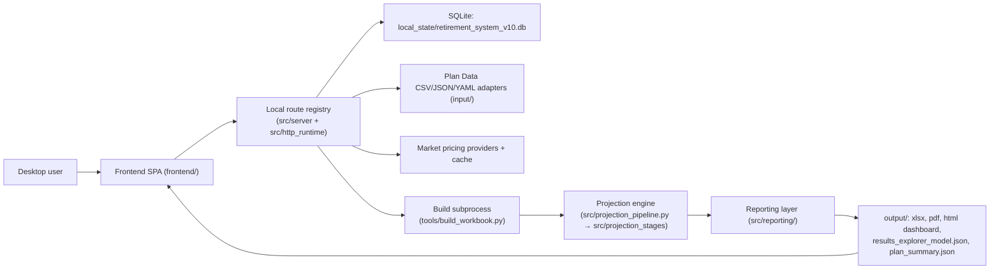
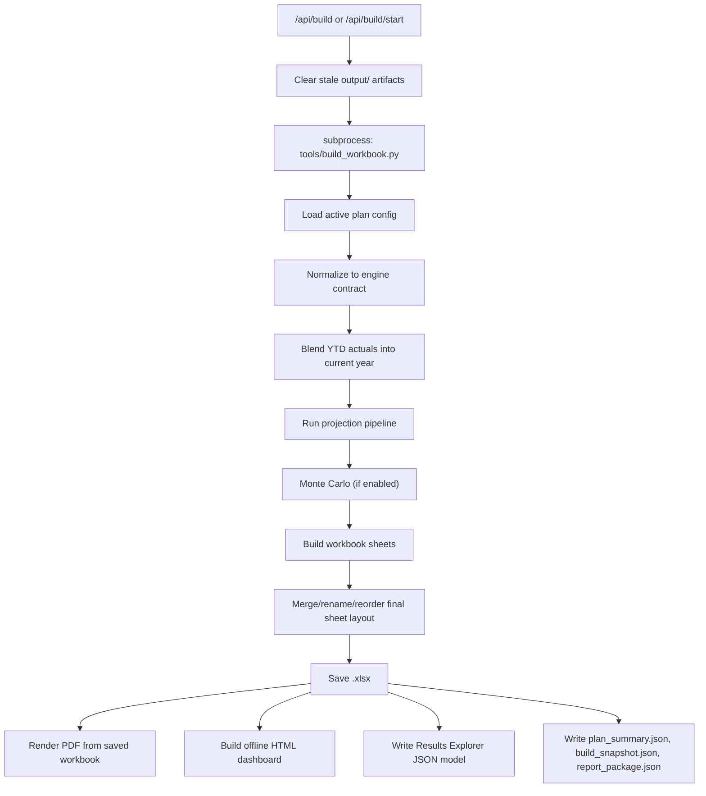

# Retirement Planning System — Current System Design Spec

Generated: 2026-08-29. This describes the system as implemented in the
current codebase, verified against source (not against prior design docs).
Where an earlier design intent has been superseded, this document describes
only what the code does now. See `documentation/FUNCTIONAL_SPEC.md` for the
companion functional/behavioral spec.

## 1. Purpose

A local-only desktop retirement planning system. It combines structured
household plan data, investment holdings, spending actuals, market pricing,
a deterministic + Monte Carlo projection engine, and advisor-grade reporting
into one guided workflow, running entirely on one machine for one household
at a time.

## 2. System context

```mermaid
flowchart LR
    User["Desktop user"] --> UI["Frontend SPA (frontend/)"]
    UI --> Runtime["Local route registry\n(src/server + src/http_runtime)"]
    Runtime --> DB["SQLite: local_state/retirement_system_v10.db"]
    Runtime --> Files["Plan Data CSV/JSON/YAML adapters (input/)"]
    Runtime --> Pricing["Market pricing providers + cache"]
    Runtime --> BuildProc["Build subprocess\n(tools/build_workbook.py)"]
    BuildProc --> Engine["Projection engine\n(src/projection_pipeline.py → src/projection_stages)"]
    Engine --> Reporting["Reporting layer (src/reporting/)"]
    Reporting --> Outputs["output/: xlsx, pdf, html dashboard,\nresults_explorer_model.json, plan_summary.json"]
    Outputs --> UI
```

## 3. Runtime architecture

### 3.1 Entry points

- `main.py` — sets `RETIREMENT_SYSTEM_*` local-mode environment defaults
  (`APP_MODE=LOCAL`, `WORKSPACE_ID=local`, `DASHBOARD_PORT=5050`,
  `REQUIRE_API_TOKEN=NO`), runs a one-time at-rest Plan Data migration, then
  dispatches to desktop or server mode. In the frozen exe, any argument
  ending in `.py` is handled by a script-runner branch (`runpy.run_path`) —
  this is how the build subprocess launches from a packaged app.
- `src/desktop_app.py` — desktop mode: opens a PyWebView native window on
  `frontend/index.html`.
- `src/desktop_api.py` (`DesktopApi`) — the JS↔Python bridge for desktop
  mode. `frontend/js/pywebview_bridge.js` intercepts every `fetch()` call and
  routes it through `window.pywebview.api.request(method, url, body)` →
  `DesktopApi.request()` → `app.test_client()` (the in-process
  `wsgi_facade.TestClient`). **No HTTP socket is ever opened in desktop
  mode** — it drives the identical route registry in-process. Binary
  downloads are special-cased: written to a temp file, then opened via
  `os.startfile`/`open`/`xdg-open`.
- `src/http_runtime/server.py` — server mode: a stdlib `ThreadingHTTPServer`
  on `127.0.0.1:5050`, opening a browser tab.
- `src/http_runtime/wsgi_facade.py` — a dependency-free, hand-built
  Flask-compatible facade: `Flask`, `Response`, `request`/`g` (via
  `contextvars`), route compilation (`<name>`, `<int:name>`, `<path:name>`),
  before/after-request hooks, `jsonify`, `send_file`, and an in-process
  `TestClient`. There is no Flask/Werkzeug/Jinja dependency anywhere in the
  packaged app.

Both launch modes route through the same `src.server.create_app()` object
and the same route/service code — the only difference is whether requests
arrive over a real socket or an in-process test client.

### 3.2 Request lifecycle

- **Server mode:** browser → TCP socket → `_Handler._handle()` parses the
  raw HTTP request → `app.handle_http(...)` → `Flask.dispatch_request`
  (`before_request` hooks including the security gate, route match,
  `after_request` including local CORS) → a route function in
  `plan_routes.py` / `workbook_routes.py` / `admin_routes.py` /
  `base_routes.py` → typically delegates to a `src/server_services/*.py`
  module → reads/writes SQLite and/or `input/*.csv` mirrors → `jsonify(...)`.
- **Desktop mode:** identical, minus the socket — see §3.1.

### 3.3 Route registration and module structure

Routes are registered as decorator side effects at import time. `src/server/
__init__.py` imports `base_routes`, `workbook_routes`, `plan_routes`,
`admin_routes` — in that order, purely for their `@app.route(...)`
registration side effects. Each of those files does `from .app_core import *`
(plus `from .security_audit import *`, re-exported through `app_core`) to
share the `app` object, helper functions, and constants — a single shared
namespace, not separately-scoped modules.

`src/server/route_manifest.py` and the stub files under `src/server/
features/` are **not route modules** — every actual `@app.route` call lives
in the four files above. `route_manifest.py` is a hand-maintained ownership
manifest used for documentation/introspection tooling only; a reader should
not infer route-level modularity from `features/`'s existence.

`src/server_services/*.py` hold the business logic behind most routes,
deliberately HTTP-framework-agnostic: they take plain dicts/paths/callables
and return `(payload, status)` tuples. The route layer owns permission
checks, request parsing, and JSON serialization; services own everything
else. Current service modules: `base_service`, `admin_service`,
`build_service`, `build_job_service`, `config_service`, `demo_plan_service`,
`holdings_service`, `plan_data_file_service`, `plan_file_service`,
`plan_forms_service`, `portfolio_service`, `pricing_service`,
`report_service`, `secret_service`, `spending_service`,
`strategy_asset_service`, `ytd_service`.

### 3.4 Route → service map

| Route group | Representative routes | Backing module |
|---|---|---|
| Build/results | `/api/build/start`, `/api/build/preflight`, `/api/build/status`, `/api/detailed-results`, `/api/report-package`, `/api/history`, `/api/xlsx`, `/api/pdf`, `/files/<path>` | `workbook_routes.py` → `build_service.py`, `build_job_service.py`, `report_service.py` |
| Plan data files | `/api/plan-data/files`, `/api/plan-data/blank`, `/api/plan-data/<file_name>` | `workbook_routes.py` → `plan_data_file_service.py` |
| Plan forms (SQLite-native) | `/api/plan/forms`, `/api/plan/forms/<path>` | `base_routes.py`/`workbook_routes.py` → `plan_forms_service.py` → `local_store.py` |
| Plan file lifecycle | `/api/plan/save-as`, `/api/plan/load-file`, `/api/plan/exit-snapshot`, `/api/plan/snapshot/compare`, `/api/plan/snapshot/restore` | `plan_routes.py` → `plan_file_service.py` |
| Config/rows | `/api/config/backends`, `/api/config/rows`, `/api/allocation-preview`, `/api/daf/recommendation` | `plan_routes.py` → `config_service.py` |
| Pricing | `/api/prices/refresh`, `/api/prices/snapshots`, `/api/prices/freeze`, `/api/prices/test-symbol[/start\|/status]` | `plan_routes.py` → `pricing_service.py` + `portfolio_analytics.py` |
| Spending | `/api/spending/dashboard`, `/api/spending/budget*`, `/api/spending/taxonomy*`, `/api/spending/rules*`, `/api/spending/alias*` | `plan_routes.py`/`workbook_routes.py` → `spending_service.py` |
| YTD | `/api/ytd/status`, `/api/ytd/transactions*`, `/api/ytd/account-setup*` | `plan_routes.py` → `ytd_service.py` |
| Strategy/assets/estate | `/api/holdings*`, `/api/liabilities`, `/api/large-discretionary-expenses`, `/api/forced-roth-conversions`, `/api/insurance-policy*`, `/api/trust-account/add`, `/api/housing/*`, `/api/capital-market/*` | `plan_routes.py`/`workbook_routes.py` → `strategy_asset_service.py`, `holdings_service.py` |
| Portfolio | `/api/portfolio/drift` | `plan_routes.py` → `portfolio_service.py` → `portfolio_analytics.py` |
| Secrets | `/api/secrets` (POST only) | `plan_routes.py` → `secret_service.py` → `secrets_store.py` |
| Admin | `/admin`, `/api/admin/csv-file/*`, `/api/admin/diagnostics`, `/api/admin/system-config`, `/api/admin/reference-files*`, `/api/admin/csv-backup`, `/api/admin/server*` | `admin_routes.py` → `admin_service.py` |
| Base/runtime | `/`, `/api/ping`, `/api/runtime`, `/api/prefs`, `/api/contracts`, `/api/glossary`, `/api/auth/*`, `/login` | `base_routes.py` |
| Demo plan | `/api/plan/demo-status`, `/api/plan/open-demo`, `/api/plan/restore-current`, `/api/plan/reset-demo` | `plan_routes.py` → `demo_plan_service.py` |

`documentation/API_CONTRACTS.md` documents a curated subset of "stable"
contracts, not the full route inventory — treat this table and the route
files as the source of truth for completeness.

### 3.5 Workspace and paths

`src/platform_runtime.py` distinguishes `package_root()` (code, read-only
assets) from `workspace_root()` (writable `input/`, `output/`,
`local_state/`, `saved_plans/`; redirectable via
`RETIREMENT_SYSTEM_WORKSPACE_ROOT` for tests). `src/workspace_context.py`
layers desktop-only path helpers over it. `active_workspace_id()` /
`active_client_id()` are hardcoded to the literal string `"local"` —
multi-tenant plumbing (`workspace_id`, `client_id` parameters) is present
throughout the codebase but always resolves to this one value; there is no
multi-tenant capability in the current package.

**Path resolution in the frozen exe:** `BASE_DIR` in `app_core.py` resolves
to `_internal/` (the PyInstaller bundle root), not the exe's parent
directory. Writable user data must be resolved relative to `sys._MEIPASS` or
the exe path, not `BASE_DIR`, in frozen mode.

## 4. Data architecture

### 4.1 Canonical source hierarchy

1. **`local_state/retirement_system_v10.db`** (SQLite) — the canonical
   source of truth. Two SQLite layers coexist in this one file:
   - `src/local_store.py` owns `plan_snapshots` (full sectioned+typed plan
     JSON, content-addressed by a SHA256-derived `snapshot_id`),
     `result_snapshots` (pruned to the last 10), `build_events`,
     `local_settings`, and relational mirrors `plan_members` /
     `plan_accounts` / `plan_income_streams` / `plan_spending_policy`.
   - `src/config_backend.py` owns `client_files` (raw CSV text per file —
     what `get_client_file()`/`set_client_file()` read and write),
     `audit_events`, `build_jobs`, and `price_snapshots`.
2. **`input/client_*.csv`** — an on-disk import/export mirror, not the
   canonical read source. Used to bootstrap the DB on first run/fresh
   checkout, and for folder download/portability.
3. **`input/client_*.yaml` / `.json`** — derived outputs regenerated from
   the DB by `export_client_json_yaml()`.

**Read path** (`_read_plan_data_file()` in `app_core.py`): reads the DB via
`get_client_file()` first; falls back to the on-disk CSV only to bootstrap,
lazily seeding the DB from it so subsequent reads are DB-canonical.
**Write path** (`_write_plan_data_file()`): writes the DB first
(authoritative) via `set_client_file()`, then the on-disk CSV mirror.
`client_data.csv` (the sectioned anchor) is the one exception — never stored
in SQLite, always materialized on disk only.

**Flat tables** (not section/subsection/label rows, no YAML counterpart),
stored only in `client_files` and on disk: `client_holdings.csv` (per-lot
account/symbol/date/shares/price/type), `client_liabilities.csv`
(auto/HELOC/student-loan debts amortized into cash flow),
`client_spending_budget_lines.csv` (per-line budget rows).

### 4.2 Concurrency

`src/plan_file_io.py`: `plan_file_lock()` (a per-path reentrant
`threading.RLock`, needed because the server is a `ThreadingHTTPServer`)
wraps `atomic_write()` (unique temp file + `os.replace`).

### 4.3 Plan snapshot lifecycle

"Save As" / "Load Saved Plan" / "Save & Exit" (`plan_file_service.py`)
operate on the **whole SQLite file**, not row-level: checkpoint the WAL
(`PRAGMA wal_checkpoint`), `shutil.copy2` the `.db` file, remove `-wal`/
`-shm` sidecars on load (plus `PRAGMA wal_checkpoint(TRUNCATE)`, preventing
stale WAL data from silently rolling back a loaded plan), and prune old
backups to the last N:

- `retirement_system_v10.db.version_<timestamp>` — on Save & Exit, last 10 kept.
- `.before_load_<timestamp>` — before each Load Saved Plan.
- `.overlaid_<timestamp>` — after a plan overlay (e.g. Start New Plan on top of existing data).
- `.before_csv_import_<timestamp>` / `.overwritten_<timestamp>` — before bulk CSV import/overwrite.

Build-time reproducibility snapshots are separate: `src/build_snapshot.py`
writes `build_snapshot.json` (fingerprints/hashes of build artifacts) plus a
`plan_database_snapshot.rpx` DB copy, consumed by the compare/restore
endpoints in §3.4.

### 4.4 Schema and migration

- `src/schema_registry.py` loads `reference_data/schema.csv` (plus a
  generated coverage backfill) into a `(section, subsection, label) → spec`
  map, used for validation, UI type inference, and `/api/config/rows`
  metadata.
- `src/plan_data_migration.py` — a versioned (`PLAN_DATA_SCHEMA_VERSION = 5`)
  idempotent at-rest **label-rename** migration (e.g. `husband_*` →
  `member_1_*`), applied to both CSV rows and every stored
  `plan_snapshots.sectioned_json` row in one transaction with rollback on
  error, run once at startup by `main.py`.
- `src/plan_data_backfill.py` — a separate, declarative mechanism
  (`PLAN_DATA_BACKFILL_ENTRIES` in `app_core.py`) that inserts *new*
  canonical rows (e.g. Roth conversion params, HELOC, QCD, TLH) into
  existing CSVs/DB content at defined anchor points — additive schema
  evolution, distinct from the rename migration above.
- `src/plan_data_registry.py` — the single-source list of sectioned CSV file
  names (`CLIENT_DATA_PART_FILES`), consumed by ~8 other modules to avoid
  copy-paste drift.

### 4.5 Plan row schema

Most plan facts use a six-column logical row: `section`, `subsection`,
`label`, `value`, `units`, `notes` — used across CSV adapters, the schema
registry, UI rendering, and reporting inputs.

## 5. Build pipeline

A "build" (workbook/report generation) runs `tools/build_workbook.py` as a
**subprocess** of the server process (`sys.executable -u
tools/build_workbook.py`, or the frozen exe's script-runner branch). Two
trigger paths:

- **Sync** (`POST /api/build`): `subprocess.run(..., timeout=cfg.
  max_build_seconds)`; `build_service.interpret_build_result()` reads
  `output/plan_summary.json`, checks it against a `RETIREMENT_SYSTEM_BUILD_ID`
  stamp to detect staleness, and regex-scans stdout for `"QC: n/n PASS"`.
- **Async** (`POST /api/build/start`): spawns a daemon `threading.Thread`
  (`build_job_service.run_build_progress_job`) that launches the same
  subprocess with line-buffered stdout, maps each line through
  `build_progress_from_line()` (regex heuristics, e.g. mapping "Monte Carlo
  exact scalar paths: n/total" to a 0–99% progress bar and a phase string),
  and stores state in an in-memory `BuildJobRegistry` (thread-safe dict
  keyed by `job_id`, pruned after 1 hour — **no persistent/multi-user build
  queue**, by design, for a single-user desktop app). Progress is polled via
  `GET /api/build/progress/<job_id>`, streamed via SSE at
  `/api/build/events/<job_id>`, or pushed directly into the desktop webview
  (`DesktopApi._push_build_progress` → JS `updateBuildProgress(...)`).

`run_build_progress_job` also diffs the local admin-config change log
between the previous and current build timestamps (the "Build Impact"
feature) and writes `last_build_metadata.json` on success.

Before a build, `_clear_current_build_outputs()` deletes stale `output/`
artifacts so old outputs can't be mistaken for the in-flight build.
`GET /api/build/preflight` (`build_service.build_preflight_payload`) reports
readiness (`current`/`ready`/`warning`/`blocked`) by comparing artifact
mtimes against the SQLite DB mtime, checking for missing-required/
schema-invalid Plan Data rows, and summarizing pricing-diagnostics
fallback/failure counts.

`src/build_entry.py::run_build()` is an alternate in-process (non-subprocess)
entry point for a host that cannot spawn a second interpreter (a future/
parallel platform target): it syncs any configured Plan Data folder,
materializes SQLite `client_files` to disk, then calls
`reporting.workbook_builder.main()` directly. **Not wired into either
desktop or server HTTP routes as of this reading.**

```mermaid
flowchart TD
    Trigger["/api/build or /api/build/start"] --> Clear["Clear stale output/ artifacts"]
    Clear --> Sub["subprocess: tools/build_workbook.py"]
    Sub --> Load["Load active plan config"]
    Load --> Normalize["Normalize to engine contract"]
    Normalize --> YTD["Blend YTD actuals into current year"]
    YTD --> Project["Run projection pipeline"]
    Project --> MC["Monte Carlo (if enabled)"]
    MC --> Sheets["Build workbook sheets"]
    Sheets --> Structure["Merge/rename/reorder final sheet layout"]
    Structure --> Save["Save .xlsx"]
    Save --> PDF["Render PDF from saved workbook"]
    Save --> HTML["Build offline HTML dashboard"]
    Save --> JSON["Write Results Explorer JSON model"]
    Save --> Summary["Write plan_summary.json, build_snapshot.json, report_package.json"]
```

Output artifacts land in `output/` (workspace-root-relative):
`retirement_plan.xlsx`, `retirement_plan.pdf`, `retirement_dashboard.html`,
`results_explorer_model.json`, `plan_summary.json`, `build_snapshot.json`,
`report_package.json`, `pricing_diagnostics.json`, `run_history.json`,
`audit_log.jsonl`, `admin_config_change_log.json`.

## 6. Projection/engine architecture

### 6.1 Pipeline facade vs. the real engine

`src/projection_pipeline.py::run_projection_pipeline()` is a thin,
self-describing facade: it wraps one call to `planning_engines.project()` in
narrative "stage" events (`DEFAULT_STAGE_ORDER` — 14 named stages such as
`DeathTransition`, `Spending`, `WithdrawalCascade`, `TaxAssessment`,
`NetWorth`). **This decomposition is explicitly not real yet** —
`STAGE_IMPLEMENTATIONS` is empty and every stage reports `"inlined"` rather
than `"completed"`; all computation happens inside one function. This exists
for observability/testability, as a scaffold toward eventual real stage
extraction (`src/projection_stages/year_state.py` — separating mutable
per-run state from immutable config — is the first concrete step in that
direction).

### 6.2 The real deterministic engine

`src/projection_stages/deterministic_engine.py::run_deterministic_
projection_stage(c)` (imported as `project()` via `planning_engines.py`) is
the actual year-by-year loop from `plan_start` to `plan_end`. Per year, in
order: death/filing transitions → asset appreciation (incl. one-time
divorce/QDRO split and home-sale logic) → income (earned, equity comp,
disability, Social Security with the funding-cut haircut, annuity/pension)
→ spending → RMDs → Roth conversions (IRMAA/ACA-PTC guardrail-aware) → tax
assessment (federal/state/NIIT/IRMAA/AMT) → the withdrawal cascade (with
in-loop TLH/gain harvesting) → end-of-year growth → net worth roll-up
(nominal and CPI-deflated) → per-year event log entries
(`EvIncome`/`EvWithdraw`/`EvTax`/`EvTransfer`/`EvHomeSale`/`EvGrowth`/
`EvDeath`/`EvRMD`/`EvWarning`) for traceability. Output is a list of
per-year row dicts — the shared contract consumed by reporting,
optimization, and Monte Carlo alike.

### 6.3 Monte Carlo engines

Two engines share one config contract (`src/planning_engines.py`):

- **`monte_carlo_exact_scalar()`** — re-runs the true scalar deterministic
  engine once per sampled path (`_run_one_mc_path`). Highest fidelity,
  slower; used for smaller sample counts and validation/parity.
- **`_mc_vectorized_projection()`** — a batched NumPy approximation that
  replays each path's account "buckets" (pretax/roth/taxable/hsa/cash)
  without re-running the full tax engine per path; used for large sample
  counts. `src/governance.py::model_risk_rating()` formally tracks which
  engine produced a given result and flags vectorized output as
  approximate — pending tolerance-bounded scalar parity, not a settled
  equivalence.

Both engines report a shared metric set: success rate, essential-fully-
funded probability, percentile net-worth/spend paths, tax NPV/ELTR
distributions, and the Guyton-Klinger guardrail shadow. `src/
vectorized_fast_core.py` centralizes covariance/moment math
(`portfolio_moments`) so the optimizer and both MC paths compute portfolio
statistics identically.

### 6.4 Optimization and scoring

- `optimize_roth_conversion_strategy()` scores ~30 candidate conversion
  policies via a multi-component LCV-based objective (lifetime-tax penalty,
  legacy/estate/survivor/ACA-PTC/liquidity components, weighted per a
  configurable `roth_objective_mode`), runs a 200-sim Monte Carlo per
  candidate to compute feasibility probability, hard-excludes any candidate
  below the 95% feasibility gate from selection, and falls back to ranking
  the full set (flagged `roth_all_candidates_infeasible`) if none clear it.
- `src/optimization.py` computes asset allocation across five selectable
  modes (user target / optimizer risk-budgeted / max-Sharpe / pure tangency
  / holding-period real-loss-aware) via mean-variance solves, incorporating
  human capital and guaranteed-income/home-equity "coverage" of
  fixed-income/REIT sleeves, and a per-asset-class include/exclude/defer
  policy (`compute_allocation_coverage`).
- `src/withdrawal_strategy_comparison.py` is a **separate, lower-fidelity**
  side-by-side of named withdrawal orders — not a re-run of the real
  cascade; it uses flat marginal/LTCG rates instead of the engine's true
  multi-round tax true-up.
- Tax NPV/ELTR: both MC engines discount each year's `total_tax` to plan
  start to get `tax_npv`, then divide by discounted gross external cash flow
  for `effective_lifetime_tax_rate`, reported as percentiles.
- `compute_baseline_lcv_and_eltr(c, rows)` and `compute_future_lcv_and_eftr(c,
  rows, as_of_year=None)` (`src/planning_engines.py`) are the single-run,
  non-candidate counterparts of `_roth_strategy_metrics`'s `lcv_score` and
  the MC engines' tax-NPV/ELTR: same discount rate (`_roth_discount_rate`)
  and PV mechanics, applied to the plan's own built projection rather than a
  Roth-conversion candidate. The baseline variant discounts to `plan_start`
  (whole-lifetime, comparable to the optimizer/MC figures); the future
  variant discounts to `as_of_year` (default: `platform_runtime.today().year`,
  so tests can pin it) and excludes rows before that year. Both are wired
  into `plan_summary.json` (`lcv`/`eltr`/`fcv`/`eftr`) by
  `workbook_builder.py`, and the future variant is also called directly by
  `sheets_summary_builder.py::build_sheet1` for the Executive Summary's
  Forward-Looking Metrics rows.

### 6.5 Stress scenarios

`src/reporting/sheets_stress.py` re-runs the deterministic engine with
config overrides (`run_scenario`): allocation mode, retire-later,
spend-more, sell-home, high-inflation, low-return, PDIA dividend/split
variants, "No Social Security Benefit Cut" (zeroing the base-case haircut),
"Divorce/QDRO Asset Split" (one-time proportional, tax-free reduction of
every investment account balance at a configured year, applied directly
against balances before growth that year — IRC §1041, no ongoing
alimony/support modeling), and a stackable Combined Stress Test.

### 6.6 Architectural patterns

- **Config-gated feature toggles.** Advanced modules are gated behind
  `c['opt']` flags or explicit policy strings, deliberately independent of
  any `module_enabled()`/optional-function mechanism, so a default plan
  (all off) projects byte-identically and golden-master tests never move.
- **Money/domain boundary.** `src/money.py`/`src/domain_models.py`
  establish Decimal-at-the-boundary, float-for-execution: user input is
  parsed as Decimal cents, converted to float for the legacy numeric engine,
  with `PlanInput`/`Account`/`Member` as a typed local domain model layered
  over the legacy CSV/JSON "sectioned data" shape.
- **Shared selection logic between engine and reporting.** TLH,
  gain-harvest, and holding-period modules are pure, side-effect-free
  "select" functions imported both by the projection engine (which mutates
  lots to actually harvest) and by reporting sheets (which call the same
  selector to build a "what would be harvested" ledger) — the sheet and the
  projection cannot disagree about what qualifies.
- **Account-registry indirection.** `src/core.py`'s consolidated
  `account_registry`/`account_access` addresses accounts by owner/
  tax-treatment/type traits rather than hardcoded account names, with an
  optional per-account draw-priority override that stable-sorts the cascade
  without disturbing unprioritized accounts.

## 7. Frontend architecture

### 7.1 Shell

`frontend/index.html` — a single-page shell: header with global actions
(Save, Download Workbook/PDF, Exit), a left guided-steps navigator
(`#sideNav`), a center pane (`#mainPane`, replaced wholesale on every
render), and a right contextual-help pane. `frontend/admin.html` is a
structurally parallel, separately-rooted shell for the admin console, driven
by `frontend/js/admin.js` rather than the dashboard scripts.

### 7.2 Monolith-being-decomposed pattern

This is not a bundler-based SPA. ~30 `dashboard_decomp_*.js` files plus
`dashboard.js` itself (still ~7,500 lines) are loaded as a mix of classic
`<script>` and ES `type="module"` tags. `dashboard.js` remains the core: it
owns the `STEPS` catalog (~35 guided steps with id/group/title/help), the
large `renderMain()` string-template switch, and dozens of module-level `let`
globals (`rows`, `activeStep`, `planLoaded`, `holdingsChanged`, etc.). Each
`dashboard_decomp_*` file is a mechanically extracted slice of that
monolith — each carries a header comment naming exactly which `dashboard.js`
globals it still reaches back into via `window.*` bridging, and most also
`Object.assign(window, {...})` their own exports so inline `onclick="..."`
HTML strings can call them.

A handful of files are genuine, independent modules rather than extracted
slices:

- `app_store.js` — a small pub/sub state container mirroring a few
  top-level flags; explicitly scaffolding for further decomposition, not
  yet the source of truth.
- `api_client.js` — a dependency-free `fetch` wrapper adding CSRF header
  injection and timeout/abort support.
- `navigation.js` — step transitions, the autosave-vs-explicit-save step
  classification, plan-independent steps, and step redirects.
- `reports_ui.js` — renders the Results Explorer (workbook sheet browser).
- `planning_workbench_ui.js` — a browser-local-only "Planning Case" store
  (localStorage), documented as never mutating the saved plan.
- `spending_dashboard.js` — the tabbed Spending workspace.
- `pywebview_bridge.js` — desktop-mode `fetch()` interception (see §3.1).

**Rendering pattern.** No virtual DOM or component framework: `renderMain()`
builds one HTML string per active step and does one `innerHTML` write per
navigation, with hand-rolled focus/selection/`
`-open-state
preservation across the replace. Server communication is plain `fetch`/
`api()` with CSRF tokens; there is no client-side router beyond `setStep(id)`.

### 7.3 Navigation model

Guided steps are grouped: Plan Status, People and Income, Spending, Assets &
Protection, Strategy, Stress Tests, Reports & Review, Settings, plus the
cross-cutting Planning Workbench. Optional-module-gated steps show an
explanatory placeholder when their module is off rather than being removed
from navigation.

## 8. Reporting/output architecture

### 8.1 Orchestration

Entry point: `src/reporting/workbook_builder.py::main()`. Flow: load active
plan config → checkpoint SQLite WAL → normalize into the engine contract
(`prepare_config_from_sectioned_data`) → optional HSA default-schedule
generation → blend YTD actuals into the current projection year → run the
full projection pipeline (Monte Carlo included when enabled) → build every
workbook sheet function-by-function into an `openpyxl.Workbook` →
`apply_final_workbook_structure()` (merge/rename/reorder legacy build-time
sheet names into final numbered tabs) → layout/format passes (column-width
overrides, numeric centering, template layout, row-height minimization) →
save `.xlsx` → post-save XML patch (chart title fonts) → generate PDF from
the same saved workbook object → generate the HTML dashboard from the
workbook → write the Results Explorer JSON model → write `plan_summary.json`
→ write build snapshot and `report_package.json`.

`plan_summary.json`'s KPI dict is the one place both the UI and the Excel
Executive Summary read headline figures from: `terminal_nw`/`lifetime_tax`
(nominal, whole-lifetime), `lcv`/`eltr` (whole-lifetime, plan-start PV,
comparable to the Roth optimizer's and Monte Carlo's own figures), and
`fcv`/`eftr` (forward-looking, PV to today, excluding elapsed years). The
Executive Summary sheet (`sheets_summary_builder.py::build_sheet1`) renders
the first two groups as "Headline Numbers" and the third as its own
"Forward-Looking Metrics (From Today)" sub-section, rather than mixing them,
since they answer different questions ("over the whole plan" vs. "from here
forward").

`src/report_compute.py` is the framework-free orchestration layer (parse →
normalize → optimize → project → validate → Monte Carlo) shared by both the
workbook builder and plain API/test paths, deliberately free of any
openpyxl dependency. `src/dashboard_ui/builder.py`/`template.py` copy
`frontend/` into `output/` so a built workbook bundle can open the offline
dashboard without a running server.

### 8.2 Four artifacts, one source of truth

See `documentation/FUNCTIONAL_SPEC.md` §5 for the audience-facing summary.
Architecturally: the Excel workbook is canonical; the PDF renders every
visible sheet of the *already-built* workbook object directly (not a
separately maintained subset) so it cannot drift from Excel; the HTML
dashboard re-opens the saved `.xlsx` with `data_only=True` and reads a
hidden `_Chart Dashboard Data` helper sheet (falling back to deriving series
from projection rows if the Charts module is off); the Results Explorer JSON
model is built by re-parsing the saved workbook (`src/detailed_results.py`)
into a renderer-neutral semantic model (`ReportSpec`/`ReportPage`/
`ReportSection`/`ReportTable`/`ReportChart` dataclasses in
`src/report_spec.py`), capped for browser performance
(`DETAILED_RESULTS_SAFE_MAX_ROWS=260`, `CHART_MAX_POINTS=45`).

`src/report_package.py` ties the four together: per-artifact existence/
size/sha256/mtime, contract/schema versions, required-vs-optional status,
and renderer roles — a QC/integrity layer, not a user-facing document.

### 8.3 Module catalog

`src/module_catalog.py` is the single source of truth classifying every
optional workbook output by the question it answers — **Projection**
("what happens as-is?"), **Optimization** ("what lever should I change?"),
**Stress test** ("does it survive events outside my control?"),
**Diagnostics** ("is the model trustworthy?"), **Reference** ("what
produced this?") — with each `OutputModule` entry declaring its
`requires_inputs` and `requires_outputs`. This is the same dependency graph
the sheet-builder call order in `workbook_builder.py::main()` follows
procedurally, and the mechanism behind `OPTIONAL_MODULE_SHEETS` gating in
`src/reporting/workbook_common.py`: a disabled module is neither built nor
sheeted — no logic executes for it at all.

## 9. Security and permissions posture

The current package is explicitly single-user and local-only, with
SaaS/multi-tenant scaffolding retained as unreachable code rather than
removed. This is a stated design choice ("the local machine boundary is the
primary trust boundary"), not an oversight — but every layer below resolves
to "always allow," and a spec reader should treat the permission machinery
as **present but inert**, not as enforced access control:

- `src/runtime_config.py`: `VALID_APP_MODES = {LOCAL}`; `load_runtime_
  config()` hardcodes `app_mode = LOCAL` unconditionally regardless of
  `system_config.csv` content.
- `src/permissions.py`: `UserContext` always has role `"advisor"`, and
  `LOCAL_PERMISSIONS` grants every permission unconditionally — `require()`
  can never deny in the current configuration.
- `src/server/security_audit.py::_authorized_and_identity()` always returns
  `(True, None)`; the `before_request` security gate therefore never
  rejects a request except for a dead-code HTTPS-redirect branch and the
  OPTIONS short-circuit. Bearer/API-token identity resolution still exists
  and populates `g.user_context` if a token is presented, but nothing
  requires one.
- CORS (`_local_cors`) sets `Access-Control-Allow-Origin: *`
  unconditionally, by design — trading away CSP/X-Frame-Options headers
  that would otherwise break `dashboard.js`'s inline `onclick="..."`
  handlers.
- **Secrets storage** (`src/secrets_store.py`) is plaintext JSON at
  `local_state/secrets.local.json`; `encryption_status()` reports
  `{"encrypted": False, "mode": "local-only"}`. No OS keychain integration,
  no at-rest encryption. This is a genuine gap if the file is ever assumed
  to hold sensitive values (e.g. pricing-provider API keys).
- **Audit logging** (`_audit()`) writes to both `output/audit_log.jsonl`
  and the `audit_events` SQLite table when enabled; `redact_text()` in
  `src/security.py` regex-scrubs obvious `api_key=`/`token=`/`password=`
  patterns before logging — best-effort pattern matching, not guaranteed
  redaction.

## 10. Known architectural notes for future readers

- `projection_pipeline.py`'s 14-stage decomposition is a facade over one
  large function, not yet real (§6.1) — do not assume individual stages can
  be tested, replaced, or reasoned about independently of the whole.
- Vectorized Monte Carlo output is explicitly labeled approximate relative
  to exact-scalar (§6.3); treat differences between the two as expected
  until a tolerance-bounded parity check exists.
- `route_manifest.py`/`server/features/*.py` describe route *ownership* for
  tooling, not actual route module boundaries (§3.3) — the four route files
  remain a single shared namespace.
- Multi-tenant identifiers (`workspace_id`, `client_id`) persist throughout
  the codebase but are hardcoded to `"local"` everywhere they resolve
  (§3.5) — there is no multi-tenant capability to build on top of without
  first removing this constraint deliberately.
- `src/build_entry.py::run_build()` is a working, unused alternate build
  entry point for a non-desktop host (§5) — it is not currently reachable
  from either shipped launch mode.
