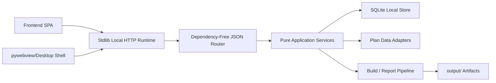

# Flask Removal Architecture

Generated: 2026-06-26

## Goal

Remove the Flask/Werkzeug dependency without changing the user's local-first workflow or the existing frontend API paths. The retirement system should remain a packaged desktop application with a local browser UI, local SQLite source of truth, and generated workbook/report artifacts.

## Implemented Target Architecture

## Design Principles

1. Preserve public URLs first. Keep `/api/...`, `/frontend/...`, and download paths stable so the frontend migration is invisible to users.
2. Move route business logic into dependency-free service functions before changing the transport.
3. Replace Flask request/response globals with explicit typed dataclasses.
4. Keep authentication/session/CSRF local and simple; do not add a hosted-server security model.
5. Remove server-side templating. The UI is already a static SPA and should stay static.
6. Prefer polling for local build progress. Server-sent events can be retained later only if implemented by the stdlib runtime.

## New Runtime Modules

- `src/http_runtime/request.py`
  - `LocalRequest`: method, path, query, headers, body bytes, JSON helper, form helper, client address.
  - `LocalResponse`: status, headers, bytes body, JSON factory, file factory.

- `src/http_runtime/router.py`
  - A small path router with explicit route registration.
  - Supports method + pattern matching such as `/api/build/progress/<job_id>`.
  - Does not import Flask or Werkzeug.

- `src/http_runtime/static_files.py`
  - Serves `frontend/`, `output/`, and selected download artifacts.
  - Strict path traversal checks.
  - MIME type detection through Python stdlib.

- `src/http_runtime/server.py`
  - `ThreadingHTTPServer` + `BaseHTTPRequestHandler` adapter.
  - Converts HTTP requests into `LocalRequest`, invokes router, writes `LocalResponse`.

- `src/server_services/`
  - Feature-owned service modules that contain request-independent business logic:
    - `base_service.py`: ping/session/runtime/preferences payloads.
    - `admin_service.py`: system configuration, admin CSV, reference files, diagnostics, server status payloads.
    - `build_service.py`: build preflight, output metadata, summary payloads.
    - `plan_forms_service.py`: SQLite-backed Plan Data forms get/save/patch payloads.
  - Remaining route modules now act as HTTP adapters for these migrated surfaces.
  - Future cleanup continues with pricing, spending/YTD, holdings/assets/strategy, and long-running build job orchestration.

## Migration Path and Current Status

### Phase A — Compatibility Facade and Route Registry — Completed

`src/http_runtime/flask_compat.py` provides a narrow stdlib-only adapter surface for the existing route decorators, request-local object, JSON/file responses, before/after hooks, URL map introspection, and test client. This avoided a risky flag-day route rewrite.

### Phase B — Stdlib Runtime — Completed

`src/http_runtime/server.py` runs the route registry through `ThreadingHTTPServer`. Browser/server mode now uses this runtime directly.

### Phase C — Desktop Bridge Migration — Completed

`src/desktop_api.py` now routes pywebview calls through the same dependency-free route registry test client. No socket is opened in desktop mode.

### Phase D — Remove Packaged Dependency — Completed

`requirements.txt` and `retirement_planner.spec` no longer package Flask, Werkzeug, Jinja, Click, ItsDangerous, MarkupSafe, or Waitress.

### Phase E — Physical Service Extraction — In Progress

The first HTTP handlers have been moved into feature-owned modules under `src/server_services/`:

- Base/runtime services own ping, auth/session payloads, preferences, safe navigation targets, and runtime metadata.
- Admin services own CSV resolution/read/write, system configuration payloads, reference file payloads, diagnostics, and local server status.
- Build services own output file metadata, summary payloads, and build-preflight readiness logic.
- Plan form services own SQLite Plan Data form get/save/patch logic.

The route files keep the public decorators and HTTP-specific concerns: permission checks, request body extraction, response serialization, file streaming, shutdown, audit calls, and background thread startup.  Remaining extraction targets are pricing, spending/YTD, holdings/assets/strategy, and build job orchestration.

## Endpoint Compatibility Contract

The following endpoint families should be migrated first because they are heavily used and already have contracts/tests:

- `/api/ping`, `/api/runtime`, `/api/prefs`
- `/api/config/rows`, `/api/plan`, `/api/plan/forms`
- `/api/build/preflight`, `/api/build/start`, `/api/build/progress/<job_id>`, `/api/build/status`
- `/api/spending/model`, `/api/spending/dashboard`, `/api/ytd/...`
- `/api/holdings`, `/api/prices/...`
- `/api/detailed-results`, `/api/summary`, `/api/history`

## Test Strategy

- Add transport-neutral unit tests for every migrated service handler.
- Keep static route-manifest tests so every public endpoint has an owner.
- Keep route-adapter tests that import `src.server`, call `/api/ping`, `/api/runtime`, and selected plan APIs without third-party web packages.
- Add packaging tests that assert Flask/Werkzeug/Jinja families are absent from `requirements.txt` and PyInstaller hidden imports.
- Add service-boundary tests that assert `src/server_services` does not import HTTP/runtime adapter modules and that migrated route modules delegate to service modules.

## Risks and Mitigations

- **File download behavior:** use `LocalResponse.file()` with explicit MIME and disposition handling.
- **Long build progress:** keep polling endpoints as the canonical progress path; avoid relying on streaming.
- **CSRF/session changes:** keep the existing token concept, but store validation in a dependency-free local session service.
- **Hidden Flask imports:** enforce a test that `src/server_services` and `src/http_runtime` do not import Flask.

