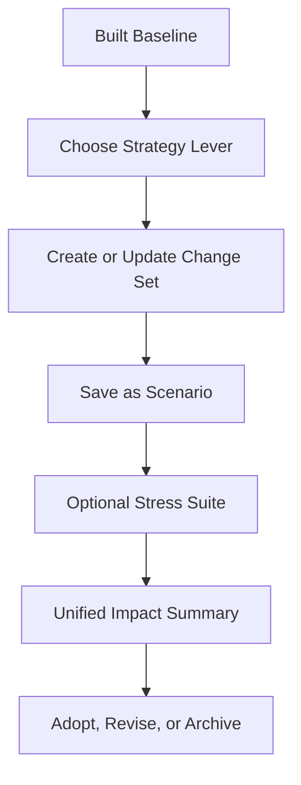

# Planning Workbench Consolidation Proposal

Generated: 2026-06-26

## Problem

Build Impact, Scenarios, Stress Testing, and Strategy are powerful but currently feel like separate tools. Users must infer how a strategy lever becomes a scenario, how a stress test relates to a build, and why Build Impact sometimes explains changes while Scenarios and Stress Tests show separate result surfaces.

## Proposed User Model

Create one coherent **Planning Workbench** mental model:

1. **Baseline** — the last saved and built plan.
2. **Change Set** — staged edits, strategy levers, or scenario overrides being evaluated.
3. **Run Type** — baseline build, scenario comparison, stress suite, or advisor report build.
4. **Impact** — the same comparison vocabulary every time: spending, taxes, risk, liquidity, estate, Roth/withdrawal movement, terminal net worth, and confidence.

## Navigation Consolidation

Keep the existing pages for continuity, but make them feel like one workflow:

- **Strategy Hub** becomes the entry point for intentional changes.
- **Scenarios** becomes the place to name and save a Change Set.
- **Stress Tests** becomes a library of adverse assumptions applied to the Baseline or a saved Scenario.
- **Build Impact** becomes the universal comparison surface for any run.

## Simplified UX Flow



## Recommended Screens

### 1. Planning Workbench Overview

A single landing card with four actions:

- Review current baseline.
- Try a strategy lever.
- Compare saved scenarios.
- Run stress suite.

### 2. Change Set Builder

A table of proposed edits with source page links, before/after values, and rationale. Sources can be:

- direct user edits
- scenario template overrides
- saved scenario set overrides
- strategy recommendations
- stress-test assumptions

### 3. Unified Comparison Matrix

Rows are scenarios/stresses. Columns are the same metrics as Build Impact:

- probability of success
- terminal net worth
- cumulative taxes
- peak drawdown/liquidity gap
- Roth conversion total
- healthcare premium and non-premium medical spending impact
- estate/survivor outcomes when relevant

### 4. Decision Panel

Every comparison ends with one of three user choices:

- Adopt selected changes into the plan.
- Save as a named scenario only.
- Archive/no action.

## Data Contract

Introduce `planning_case_v1`:

```json
{
  "case_id": "string",
  "name": "string",
  "base_snapshot_id": "string",
  "source": "strategy|scenario|stress|manual",
  "overrides": [],
  "run_type": "quick_compare|full_build|stress_suite",
  "result_summary": {},
  "created_at": "iso8601"
}
```

## Implementation Sequence

1. Add a `planning_case_v1` browser-local store for named cases.
2. Normalize scenario templates and strategy recommendation actions into the same override list.
3. Let Stress Tests run against either Baseline or a selected planning case.
4. Teach Build Impact to display any two case/result summaries, not only latest build vs prior build.
5. Rename UI copy from isolated tools to workbench language while preserving existing routes.

## Guardrails

- No strategy or scenario change should apply to the saved plan without explicit user action.
- Every suggested change needs a source page link and before/after values.
- Stress tests should be labeled as adverse assumptions, not forecasts.
- The workbook/report package remains generated only from the saved plan or an explicitly selected scenario package.


## Implementation Status

Implemented in the Planning Workbench consolidation pass:

- Added a dedicated **Planning Workbench** guided step before Strategy Levers.
- Added browser-local `planning_case_v1` storage for named planning cases.
- Added a shared Python contract helper in `src/planning_workbench.py` for validation/documentation and future import/export.
- Normalized manual edits, strategy levers, scenario overrides, and stress assumptions into one override-list presentation.
- Added a Change Set Builder, Unified Comparison Matrix, Stress Suite target selector, and Decision Panel.
- Updated Build Impact into **Impact & Build History** and added Planning Workbench comparison context above the latest-build impact cards.
- Preserved legacy page routes as source pages: Strategy Levers, Scenario Change Sets, Stress Suite & Monte Carlo, and Impact & Build History.
- Retained the guardrail that no planning case changes the saved plan without explicit source-page edit, Save Changes, and rebuild.
