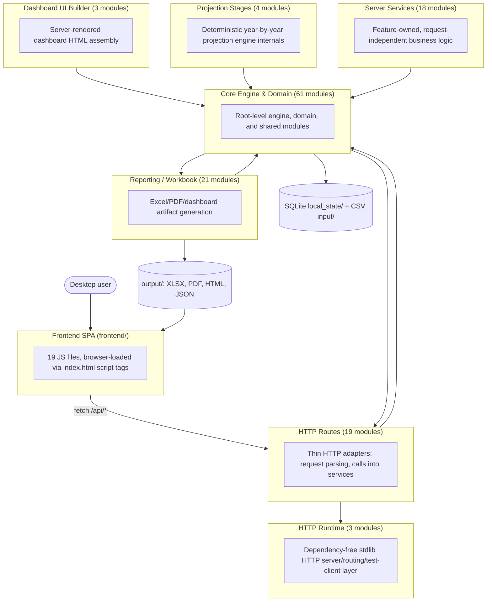

# System Architecture Diagram

**Auto-generated. Do not hand-edit.** Run `python tools/generate_system_diagram.py` after adding, removing, or moving modules, changing imports, or editing `src/module_catalog.py` / `src/server/route_manifest.py`. The script statically parses the codebase, so this document cannot drift from what the code actually does -- if it looks wrong, the fix is to rerun the generator, not to edit this file.

Source: `tools/generate_system_diagram.py`. Modules scanned: 129 Python files under `src/`, 19 JS files under `frontend/`.

## 1. Layer Architecture

Every box is a real directory in the repo. Every arrow is a real `import` found by parsing the code -- not an aspirational diagram.

## 2. Imported (Third-Party) Modules

From `requirements.txt` (the authoritative declared list):

- `numpy>=1.26,<3`
- `scipy>=1.10,<2`
- `lxml>=4.9,<7`
- `openpyxl>=3.1,<4`
- `reportlab>=4.0,<6`
- `matplotlib>=3.8,<4`
- `pillow>=10,<12`
- `cryptography>=42,<46`
- `pywebview>=4.0,<7`

Actual usage detected per layer (which layer imports which third-party package):

| Layer | Third-party imports found |
|---|---|
| HTTP Routes | _none (stdlib only)_ |
| Server Services | _none (stdlib only)_ |
| HTTP Runtime | _none (stdlib only)_ |
| Core Engine & Domain | `numpy`, `openpyxl`, `pywebview`, `pyyaml`, `requests`, `scipy` |
| Projection Stages | _none (stdlib only)_ |
| Reporting / Workbook | `lxml`, `matplotlib`, `numpy`, `openpyxl`, `reportlab`, `scipy` |
| Dashboard UI Builder | _none (stdlib only)_ |

**Detected but not in `requirements.txt`:** `pyyaml`, `requests`. Worth checking each one at the import site: as of this writing, `pyyaml` and `requests` are both guarded by `try/except ImportError` as optional/lazy imports (the feature degrades rather than crashing if absent) -- confirm any newly-appearing name here follows the same pattern before assuming it's safe to leave undeclared.

## 3. Data Flow: Plan Inputs to Report Outputs

Generated by importing `src/module_catalog.py` directly -- the module's own docstring calls it "the single source of truth" for this mapping, so the diagram below is always exactly what the code will do, not a snapshot.

```mermaid
flowchart LR
    IN_household(["Household & timing"])
    IN_income(["Income"])
    IN_spending(["Spending"])
    IN_assets(["Assets & liquidity"])
    IN_liabilities(["Liabilities"])
    IN_holdings(["Holdings & lots"])
    IN_planning_levers(["Planning Levers"])
    IN_insurance_estate(["Insurance & estate"])
    IN_business(["Business"])
    IN_assumptions(["Assumptions (economic/tax)"])
    IN_pricing(["Market pricing"])
    IN_ytd(["YTD actuals"])
    IN_toggles(["Module toggles"])
    OUT_net_worth["Net Worth\n(projection)"]
    IN_household --> OUT_net_worth
    IN_assets --> OUT_net_worth
    IN_liabilities --> OUT_net_worth
    IN_holdings --> OUT_net_worth
    IN_assumptions --> OUT_net_worth
    OUT_cash_flow["Cash Flow\n(projection)"]
    IN_income --> OUT_cash_flow
    IN_spending --> OUT_cash_flow
    IN_liabilities --> OUT_cash_flow
    IN_household --> OUT_cash_flow
    OUT_balance_sheet["Balance Sheet\n(projection)"]
    IN_assets --> OUT_balance_sheet
    IN_liabilities --> OUT_balance_sheet
    IN_holdings --> OUT_balance_sheet
    OUT_executive_summary["Executive Summary\n(projection)"]
    OUT_net_worth --> OUT_executive_summary
    OUT_cash_flow --> OUT_executive_summary
    OUT_balance_sheet --> OUT_executive_summary
    OUT_lifetime_tax_projection["Lifetime Taxes\n(projection)"]
    IN_income --> OUT_lifetime_tax_projection
    IN_spending --> OUT_lifetime_tax_projection
    IN_holdings --> OUT_lifetime_tax_projection
    IN_assumptions --> OUT_lifetime_tax_projection
    OUT_net_worth --> OUT_lifetime_tax_projection
    OUT_cash_flow --> OUT_lifetime_tax_projection
    OUT_spending_summary["Spending Summary\n(projection)"]
    IN_spending --> OUT_spending_summary
    OUT_charts_dashboard["Charts\n(projection)"]
    OUT_net_worth --> OUT_charts_dashboard
    OUT_cash_flow --> OUT_charts_dashboard
    OUT_asset_allocation --> OUT_charts_dashboard
    OUT_roth_conversion_plan["Roth Conversion\n(optimization)"]
    IN_planning_levers --> OUT_roth_conversion_plan
    IN_income --> OUT_roth_conversion_plan
    IN_assumptions --> OUT_roth_conversion_plan
    OUT_net_worth --> OUT_roth_conversion_plan
    OUT_cash_flow --> OUT_roth_conversion_plan
    OUT_asset_allocation["Asset Allocation\n(optimization)"]
    IN_planning_levers --> OUT_asset_allocation
    IN_holdings --> OUT_asset_allocation
    IN_assumptions --> OUT_asset_allocation
    OUT_social_security_timing["Social Security\n(optimization)"]
    IN_household --> OUT_social_security_timing
    IN_planning_levers --> OUT_social_security_timing
    OUT_net_worth --> OUT_social_security_timing
    OUT_cash_flow --> OUT_social_security_timing
    OUT_retirement_strategy["Withdrawal Sequencing\n(optimization)"]
    IN_planning_levers --> OUT_retirement_strategy
    IN_assets --> OUT_retirement_strategy
    IN_holdings --> OUT_retirement_strategy
    OUT_net_worth --> OUT_retirement_strategy
    OUT_cash_flow --> OUT_retirement_strategy
    OUT_asset_location["Asset Location\n(optimization)"]
    IN_holdings --> OUT_asset_location
    IN_planning_levers --> OUT_asset_location
    IN_assumptions --> OUT_asset_location
    OUT_what_if_analysis["What-If / Scenario\n(optimization)"]
    IN_planning_levers --> OUT_what_if_analysis
    OUT_net_worth --> OUT_what_if_analysis
    OUT_cash_flow --> OUT_what_if_analysis
    OUT_tax_loss_harvesting["Tax-Loss Harvesting\n(optimization)"]
    IN_holdings --> OUT_tax_loss_harvesting
    IN_pricing --> OUT_tax_loss_harvesting
    OUT_gain_harvesting["Gain Harvesting\n(optimization)"]
    IN_holdings --> OUT_gain_harvesting
    IN_pricing --> OUT_gain_harvesting
    OUT_charitable_giving["Charitable Giving\n(optimization)"]
    IN_assets --> OUT_charitable_giving
    IN_spending --> OUT_charitable_giving
    IN_income --> OUT_charitable_giving
    IN_household --> OUT_charitable_giving
    IN_assumptions --> OUT_charitable_giving
    OUT_state_residency["State Residency\n(optimization)"]
    IN_planning_levers --> OUT_state_residency
    IN_income --> OUT_state_residency
    IN_assumptions --> OUT_state_residency
    OUT_estate_legacy_plan["Estate & Legacy\n(optimization)"]
    IN_insurance_estate --> OUT_estate_legacy_plan
    IN_assets --> OUT_estate_legacy_plan
    IN_household --> OUT_estate_legacy_plan
    IN_assumptions --> OUT_estate_legacy_plan
    OUT_education_funding_529["Education Funding 529\n(optimization)"]
    IN_insurance_estate --> OUT_education_funding_529
    IN_assumptions --> OUT_education_funding_529
    OUT_equity_compensation["Equity Compensation\n(optimization)"]
    IN_insurance_estate --> OUT_equity_compensation
    IN_assumptions --> OUT_equity_compensation
    OUT_scorp_vs_llc["S-Corp vs LLC\n(optimization)"]
    IN_income --> OUT_scorp_vs_llc
    IN_business --> OUT_scorp_vs_llc
    IN_assumptions --> OUT_scorp_vs_llc
    OUT_business_succession["Business Succession\n(optimization)"]
    IN_business --> OUT_business_succession
    OUT_special_needs_planning["Special-Needs Planning\n(optimization)"]
    IN_household --> OUT_special_needs_planning
    IN_insurance_estate --> OUT_special_needs_planning
    OUT_life_insurance_need["Life Insurance Need\n(optimization)"]
    IN_insurance_estate --> OUT_life_insurance_need
    IN_income --> OUT_life_insurance_need
    OUT_survivor_stress_test --> OUT_life_insurance_need
    OUT_existing_life_insurance["Existing Life Insurance\n(optimization)"]
    IN_insurance_estate --> OUT_existing_life_insurance
    OUT_survivor_stress_test --> OUT_existing_life_insurance
    OUT_disability_income_insurance["Disability Income\n(optimization)"]
    IN_insurance_estate --> OUT_disability_income_insurance
    IN_income --> OUT_disability_income_insurance
    OUT_cash_flow --> OUT_disability_income_insurance
    OUT_property_casualty_umbrella["P&C / Umbrella\n(optimization)"]
    IN_insurance_estate --> OUT_property_casualty_umbrella
    OUT_net_worth --> OUT_property_casualty_umbrella
    OUT_market_luck_stress_test["Monte Carlo\n(stress_test)"]
    IN_assumptions --> OUT_market_luck_stress_test
    IN_planning_levers --> OUT_market_luck_stress_test
    OUT_net_worth --> OUT_market_luck_stress_test
    OUT_cash_flow --> OUT_market_luck_stress_test
    OUT_survivor_stress_test["Survivor / Early Death\n(stress_test)"]
    IN_household --> OUT_survivor_stress_test
    IN_income --> OUT_survivor_stress_test
    IN_insurance_estate --> OUT_survivor_stress_test
    OUT_net_worth --> OUT_survivor_stress_test
    OUT_cash_flow --> OUT_survivor_stress_test
    OUT_long_term_care_stress["LTC Stress\n(stress_test)"]
    IN_insurance_estate --> OUT_long_term_care_stress
    IN_assets --> OUT_long_term_care_stress
    IN_assumptions --> OUT_long_term_care_stress
    OUT_net_worth --> OUT_long_term_care_stress
    OUT_cash_flow --> OUT_long_term_care_stress
    OUT_divorce_qdro["Divorce / QDRO\n(stress_test)"]
    IN_household --> OUT_divorce_qdro
    IN_assets --> OUT_divorce_qdro
    IN_holdings --> OUT_divorce_qdro
    OUT_net_worth --> OUT_divorce_qdro
    OUT_cash_flow --> OUT_divorce_qdro
    OUT_quality_control["Quality Control\n(diagnostics)"]
    OUT_net_worth --> OUT_quality_control
    OUT_cash_flow --> OUT_quality_control
    OUT_rmd_audit["RMD Audit\n(diagnostics)"]
    IN_household --> OUT_rmd_audit
    IN_assumptions --> OUT_rmd_audit
    OUT_net_worth --> OUT_rmd_audit
    OUT_account_reconciliation["Account Reconciliation\n(diagnostics)"]
    IN_holdings --> OUT_account_reconciliation
    IN_ytd --> OUT_account_reconciliation
    OUT_planning_levers_echo["Planning Levers (echo)\n(reference)"]
    IN_planning_levers --> OUT_planning_levers_echo
    OUT_assumptions_ref["Assumptions\n(reference)"]
    IN_assumptions --> OUT_assumptions_ref
    OUT_plan_data_ref["Plan Data\n(reference)"]
    IN_household --> OUT_plan_data_ref
    IN_income --> OUT_plan_data_ref
    IN_spending --> OUT_plan_data_ref
    IN_assets --> OUT_plan_data_ref
    IN_liabilities --> OUT_plan_data_ref
    IN_holdings --> OUT_plan_data_ref
    IN_planning_levers --> OUT_plan_data_ref
    IN_insurance_estate --> OUT_plan_data_ref
    IN_business --> OUT_plan_data_ref
    IN_assumptions --> OUT_plan_data_ref
    IN_pricing --> OUT_plan_data_ref
    IN_ytd --> OUT_plan_data_ref
    IN_toggles --> OUT_plan_data_ref
    OUT_methodology_rerun["Methodology & Re-Run\n(reference)"]
    OUT_glossary["Glossary\n(reference)"]
```

Input modules: 13. Output modules: 39.

## 4. Frontend ↔ Server API Surface

Generated by importing `src/server/route_manifest.py` (`ROUTE_MODULES`), the ownership map each feature-service module registers routes under.

| Feature module | Routes owned |
|---|---|
| `build_results` | 10 routes: `/api/build/preflight`, `/api/build/start`, `/api/build/status/<job_id>`, `/api/detailed-results`, `/api/report-package`, `/api/history`, ... |
| `plan_data` | 5 routes: `/api/plan/forms`, `/api/plan/save-as`, `/api/plan/load-file`, `/api/plan/snapshot/compare`, `/api/plan/snapshot/restore` |
| `plan_config` | 3 routes: `/api/config/backends`, `/api/config/rows`, `/api/allocation-preview` |
| `pricing` | 7 routes: `/api/prices/refresh`, `/api/prices/snapshots`, `/api/prices/freeze`, `/api/prices/unfreeze`, `/api/prices/test-symbol`, `/api/prices/test-symbol/start`, ... |
| `portfolio` | 1 route: `/api/portfolio/drift` |
| `security` | 1 route: `/api/secrets` |
| `spending` | 18 routes: `/api/spending/model`, `/api/spending/budget`, `/api/spending/category`, `/api/spending/dashboard`, `/api/spending/summary`, `/api/spending/taxonomy`, ... |
| `ytd` | 3 routes: `/api/ytd/status`, `/api/ytd/transactions`, `/api/ytd/transactions/preview` |
| `strategy_assets` | 22 routes: `/api/holdings`, `/api/holdings/preview`, `/api/large-discretionary-expenses`, `/api/forced-roth-conversions`, `/api/liquidity-buffers`, `/api/other-asset/add`, ... |
| `admin` | 4 routes: `/api/admin/diagnostics`, `/api/admin/system-config`, `/api/contracts`, `/api/glossary` |

## 5. Frontend Layer (frontend/)

Script load order, as declared in `frontend/index.html` (this is the frontend's real dependency order -- no bundler, no ES module graph):

1. `js/pywebview_bridge.js`
2. `js/dashboard_shared_helpers.js?v=1`
3. `js/api_client.js?v=1`
4. `js/app_store.js?v=1`
5. `js/navigation.js?v=2`
6. `js/reports_ui.js?v=2`
7. `js/planning_workbench_ui.js?v=2`
8. `js/dashboard_decomp_estate_insurance.js?v=3`
9. `js/dashboard_decomp_build_lifecycle.js?v=2`
10. `js/dashboard_decomp_supplemental_tables.js?v=1`
11. `js/dashboard_decomp_local_backups.js?v=1`
12. `js/dashboard.js?v=43`
13. `js/dashboard_decomp_workbook_formatting.js?v=1`
14. `js/dashboard_decomp_home_panels.js?v=1`
15. `js/modules/phase3_module_manifest.js?v=1`
16. `js/dashboard_source_truth_banners.js?v=1`
17. `js/dashboard_batch_assumption_edit.js?v=1`
18. `js/spending_dashboard.js?v=11`

All `.js` files found under `frontend/` (19):

- `frontend/js/admin.js`
- `frontend/js/api_client.js`
- `frontend/js/app_store.js`
- `frontend/js/dashboard.js`
- `frontend/js/dashboard_batch_assumption_edit.js`
- `frontend/js/dashboard_decomp_build_lifecycle.js`
- `frontend/js/dashboard_decomp_estate_insurance.js`
- `frontend/js/dashboard_decomp_home_panels.js`
- `frontend/js/dashboard_decomp_local_backups.js`
- `frontend/js/dashboard_decomp_supplemental_tables.js`
- `frontend/js/dashboard_decomp_workbook_formatting.js`
- `frontend/js/dashboard_shared_helpers.js`
- `frontend/js/dashboard_source_truth_banners.js`
- `frontend/js/modules/phase3_module_manifest.js`
- `frontend/js/navigation.js`
- `frontend/js/planning_workbench_ui.js`
- `frontend/js/pywebview_bridge.js`
- `frontend/js/reports_ui.js`
- `frontend/js/spending_dashboard.js`

Files present under `frontend/js/` but not referenced by `index.html`'s script tags (`admin.js`): loaded by a different page (e.g. an admin/standalone HTML entry point), or dead code -- check before assuming either.

## 6. Appendix: Full Module Dependency Table

Every developed module under `src/`, grouped by layer, with its internal and external imports. This is the ground truth the diagrams above are aggregated from.

### HTTP Routes

| Module | Internal imports | External imports |
|---|---|---|
| `src/server/__init__.py` | `server`, `server.app_core` | — |
| `src/server/__main__.py` | `http_runtime.server`, `server` | — |
| `src/server/admin_routes.py` | `governance`, `server.app_core`, `server_services`, `version` | — |
| `src/server/app_core.py` | `src`, `config_backend`, `http_runtime.wsgi_facade`, `permissions`, `roth_ui_build_guard`, `runtime_config`, `schema_registry`, `secrets_store`, `security`, `server.plan_data_files`, `server.security_audit`, `system_config`, `workspace_context` | — |
| `src/server/base_routes.py` | `api_contracts`, `glossary`, `server.app_core`, `server.route_manifest`, `server_services`, `version` | — |
| `src/server/plan_data_files.py` | `plan_data_registry` | — |
| `src/server/plan_routes.py` | `src`, `portfolio_analytics`, `secrets_store`, `server.app_core`, `server_services`, `version` | — |
| `src/server/route_manifest.py` | — | — |
| `src/server/security_audit.py` | `config_backend`, `http_runtime.wsgi_facade`, `permissions`, `security`, `server`, `workspace_context` | — |
| `src/server/workbook_routes.py` | `build_snapshot`, `http_runtime.wsgi_facade`, `import_preview`, `reporting`, `results_model`, `schema_registry`, `server.app_core`, `server_forecast`, `server_services` | — |
| `src/server/wsgi.py` | `server` | — |

### Server Services

| Module | Internal imports | External imports |
|---|---|---|
| `src/server_services/__init__.py` | — | — |
| `src/server_services/admin_service.py` | `plan_data_registry` | — |
| `src/server_services/base_service.py` | — | — |
| `src/server_services/build_job_service.py` | — | — |
| `src/server_services/build_service.py` | `report_package`, `schema_registry`, `server_services` | — |
| `src/server_services/config_service.py` | `src`, `module_catalog`, `optimization`, `report_compute`, `roth_ui_build_guard`, `schema_registry` | — |
| `src/server_services/demo_plan_service.py` | — | — |
| `src/server_services/holdings_service.py` | `config_backend`, `workspace_context` | — |
| `src/server_services/plan_data_file_service.py` | — | — |
| `src/server_services/plan_file_service.py` | `build_snapshot` | — |
| `src/server_services/plan_forms_service.py` | `local_store` | — |
| `src/server_services/portfolio_service.py` | — | — |
| `src/server_services/pricing_service.py` | `config_backend`, `market_data`, `portfolio_analytics` | — |
| `src/server_services/report_service.py` | `detailed_results`, `report_package` | — |
| `src/server_services/secret_service.py` | — | — |
| `src/server_services/spending_service.py` | `src` | — |
| `src/server_services/strategy_asset_service.py` | — | — |
| `src/server_services/ytd_service.py` | `src`, `import_preview` | — |

### HTTP Runtime

| Module | Internal imports | External imports |
|---|---|---|
| `src/http_runtime/__init__.py` | `http_runtime.wsgi_facade` | — |
| `src/http_runtime/server.py` | `http_runtime.wsgi_facade` | — |
| `src/http_runtime/wsgi_facade.py` | `http_runtime.server` | — |

### Core Engine & Domain

| Module | Internal imports | External imports |
|---|---|---|
| `src/__init__.py` | `version` | — |
| `src/after_tax.py` | `core` | — |
| `src/allocation_policy.py` | — | — |
| `src/api_contracts.py` | — | — |
| `src/build_entry.py` | `config_backend`, `local_plan_data_sync`, `reporting.workbook_builder` | — |
| `src/build_snapshot.py` | `version` | — |
| `src/config_backend.py` | `src`, `local_store`, `plan_data_registry`, `system_config` | `pyyaml` |
| `src/core.py` | `person_labels` | — |
| `src/data_io.py` | `config_backend`, `core`, `market_data`, `money`, `plan_config`, `plan_data_migration`, `plan_data_registry`, `portfolio_analytics`, `report_compute`, `roth_ui_build_guard`, `spending_budget_resolver`, `system_config`, `workspace_context` | — |
| `src/desktop_api.py` | `server`, `server.app_core`, `server.workbook_routes`, `server_services` | `pywebview` |
| `src/desktop_app.py` | `desktop_api` | `pywebview` |
| `src/detailed_results.py` | `results_model` | `openpyxl` |
| `src/domain_models.py` | `money`, `person_labels`, `plan_data_migration` | — |
| `src/equity_comp.py` | — | — |
| `src/gain_harvest.py` | `tlh` | — |
| `src/glossary.py` | `core`, `taxes` | — |
| `src/governance.py` | `src`, `version` | — |
| `src/holding_period.py` | — | — |
| `src/import_preview.py` | `ytd_tracking` | — |
| `src/local_backup_scheduler.py` | — | — |
| `src/local_plan_data_sync.py` | `plan_data_registry`, `runtime_config`, `workspace_context` | — |
| `src/local_store.py` | `domain_models` | `pyyaml` |
| `src/market_data.py` | `secrets_store`, `version` | `requests` |
| `src/module_catalog.py` | — | — |
| `src/money.py` | — | — |
| `src/observability.py` | — | — |
| `src/optimization.py` | `allocation_policy`, `holding_period`, `real_loss_curves`, `vectorized_fast_core`, `workspace_context` | `numpy`, `scipy` |
| `src/permissions.py` | — | — |
| `src/person_labels.py` | — | — |
| `src/plan_config.py` | — | — |
| `src/plan_data_backfill.py` | — | — |
| `src/plan_data_migration.py` | — | — |
| `src/plan_data_registry.py` | — | — |
| `src/planning_engines.py` | `after_tax`, `core`, `observability`, `optimization`, `plan_config`, `projection_stages`, `vectorized_fast_core` | `numpy` |
| `src/planning_workbench.py` | — | — |
| `src/platform_runtime.py` | — | — |
| `src/portfolio_analytics.py` | `config_backend` | — |
| `src/projection_pipeline.py` | `observability`, `planning_engines` | — |
| `src/real_loss_curves.py` | `allocation_policy`, `workspace_context` | — |
| `src/report_compute.py` | `data_io`, `governance`, `local_store`, `market_data`, `plan_config`, `planning_engines`, `projection_pipeline`, `report_spec`, `result_contract`, `results_model` | — |
| `src/report_package.py` | `build_snapshot`, `results_model`, `version` | — |
| `src/report_spec.py` | — | — |
| `src/result_contract.py` | `report_spec`, `results_model`, `tax_law`, `version` | — |
| `src/results_model.py` | `person_labels`, `version` | — |
| `src/roth_ui_build_guard.py` | — | — |
| `src/runtime_config.py` | `system_config` | — |
| `src/schema_registry.py` | `src`, `plan_data_registry` | — |
| `src/secrets_store.py` | — | — |
| `src/security.py` | `runtime_config` | — |
| `src/server_forecast.py` | `after_tax`, `core`, `report_compute` | — |
| `src/spending_budget_resolver.py` | `spending_tracker` | — |
| `src/spending_tracker.py` | `platform_runtime` | — |
| `src/system_config.py` | — | — |
| `src/tax_law.py` | — | — |
| `src/taxes.py` | `tax_law` | — |
| `src/tlh.py` | — | — |
| `src/vectorized_fast_core.py` | — | `numpy` |
| `src/version.py` | — | — |
| `src/workspace_context.py` | `src`, `runtime_config` | — |
| `src/ytd_projection_blend.py` | `spending_tracker`, `ytd_tracking` | — |
| `src/ytd_tracking.py` | — | — |

### Projection Stages

| Module | Internal imports | External imports |
|---|---|---|
| `src/projection_stages/__init__.py` | `projection_stages.deterministic_engine`, `projection_stages.year_state` | — |
| `src/projection_stages/budget_rollups.py` | — | — |
| `src/projection_stages/deterministic_engine.py` | `core`, `equity_comp`, `planning_engines`, `projection_stages.budget_rollups`, `projection_stages.year_state` | — |
| `src/projection_stages/year_state.py` | — | — |

### Reporting / Workbook

| Module | Internal imports | External imports |
|---|---|---|
| `src/reporting/__init__.py` | `reporting.sheets_allocation_helpers`, `reporting.sheets_projection_facade`, `reporting.sheets_summary_builder`, `reporting.sheets_tax_reporter`, `reporting.workbook_builder` | — |
| `src/reporting/dashboard.py` | `core`, `person_labels`, `reporting.workbook_common`, `reporting.workbook_xml_optimizer` | `openpyxl` |
| `src/reporting/enterprise_pdf.py` | — | `matplotlib`, `openpyxl`, `reportlab` |
| `src/reporting/sheets_allocation_helpers.py` | `person_labels`, `reporting.workbook_common` | `numpy`, `scipy` |
| `src/reporting/sheets_projection_cashflow.py` | `reporting.workbook_common` | — |
| `src/reporting/sheets_projection_charts.py` | `reporting.workbook_common` | `openpyxl` |
| `src/reporting/sheets_projection_facade.py` | `reporting.sheets_projection_cashflow`, `reporting.sheets_projection_charts`, `reporting.sheets_projection_net_worth`, `reporting.sheets_projection_tax` | — |
| `src/reporting/sheets_projection_net_worth.py` | `reporting.workbook_common` | — |
| `src/reporting/sheets_projection_tax.py` | `reporting.workbook_common` | — |
| `src/reporting/sheets_protection.py` | `reporting.workbook_common` | — |
| `src/reporting/sheets_qc_reference.py` | `data_io`, `glossary`, `governance`, `person_labels`, `reporting.workbook_common` | — |
| `src/reporting/sheets_strategy.py` | `after_tax`, `person_labels`, `planning_engines`, `reporting`, `reporting.workbook_common` | — |
| `src/reporting/sheets_stress.py` | `optimization`, `person_labels`, `planning_engines`, `reporting.workbook_common` | — |
| `src/reporting/sheets_summary_builder.py` | `governance`, `reporting`, `reporting.sheets_allocation_helpers`, `reporting.workbook_common` | — |
| `src/reporting/sheets_tax_reporter.py` | `reporting.workbook_common` | — |
| `src/reporting/sheets_wealth.py` | `reporting.workbook_common` | — |
| `src/reporting/summary_figures.py` | — | — |
| `src/reporting/workbook_builder.py` | `after_tax`, `build_snapshot`, `governance`, `report_package`, `reporting.dashboard`, `reporting.enterprise_pdf`, `reporting.sheets_allocation_helpers`, `reporting.sheets_projection_facade`, `reporting.sheets_protection`, `reporting.sheets_qc_reference`, `reporting.sheets_strategy`, `reporting.sheets_stress`, `reporting.sheets_summary_builder`, `reporting.sheets_tax_reporter`, `reporting.sheets_wealth`, `reporting.workbook_common`, `reporting.workbook_format_config`, `results_model`, `spending_tracker`, `ytd_projection_blend` | — |
| `src/reporting/workbook_common.py` | `config_backend`, `core`, `data_io`, `market_data`, `module_catalog`, `planning_engines`, `report_compute`, `workspace_context` | `openpyxl` |
| `src/reporting/workbook_format_config.py` | `workspace_context` | `openpyxl` |
| `src/reporting/workbook_xml_optimizer.py` | — | `lxml`, `openpyxl` |

### Dashboard UI Builder

| Module | Internal imports | External imports |
|---|---|---|
| `src/dashboard_ui/__init__.py` | `dashboard_ui.builder` | — |
| `src/dashboard_ui/builder.py` | — | — |

---

**Keeping this current:** rerun `python tools/generate_system_diagram.py` after any module add/move/delete, import change, or edit to `module_catalog.py` / `route_manifest.py`. For automatic drift detection, add a CI step that runs the generator and fails the build if `git diff --exit-code documentation/SYSTEM_ARCHITECTURE_DIAGRAM.md` is non-empty.
