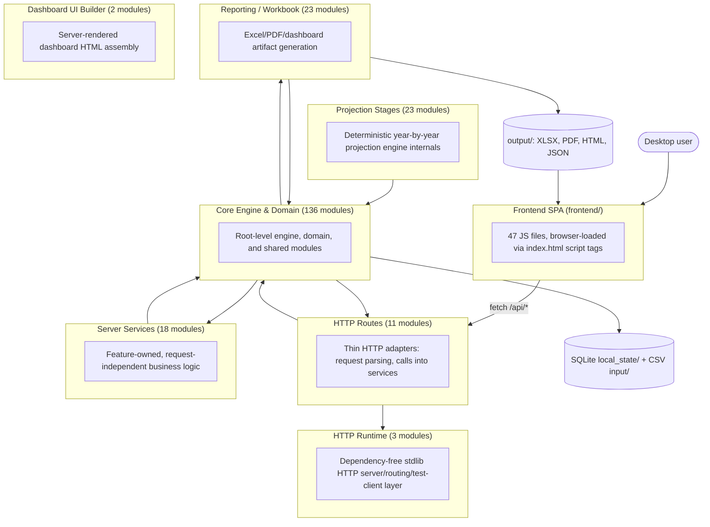

# System Architecture Diagram

**Auto-generated. Do not hand-edit.** Run `python tools/generate_system_diagram.py` after adding, removing, or moving modules, changing imports, or editing `src/module_catalog.py` / `src/server/route_manifest.py`. The script statically parses the codebase, so this document cannot drift from what the code actually does -- if it looks wrong, the fix is to rerun the generator, not to edit this file.

Source: `tools/generate_system_diagram.py`. Modules scanned: 216 Python files under `src/`, 47 JS files under `frontend/`.

## 1. Layer Architecture

Every box is a real directory in the repo. Every arrow is a real `import` found by parsing the code -- not an aspirational diagram.

## 2. Imported (Third-Party) Modules

From `requirements.txt` (the authoritative declared list):

- `numpy>=1.26,<3`
- `scipy>=1.10,<2`
- `lxml>=4.9,<7`
- `openpyxl>=3.1,<4`
- `pywebview>=4.0,<7`

Actual usage detected per layer (which layer imports which third-party package):

| Layer | Third-party imports found |
|---|---|
| HTTP Routes | _none (stdlib only)_ |
| Server Services | _none (stdlib only)_ |
| HTTP Runtime | _none (stdlib only)_ |
| Core Engine & Domain | `numpy`, `openpyxl`, `pywebview`, `pyyaml`, `requests`, `scipy` |
| Projection Stages | _none (stdlib only)_ |
| Reporting / Workbook | `lxml`, `numpy`, `openpyxl`, `scipy` |
| Dashboard UI Builder | _none (stdlib only)_ |

**Detected but not in `requirements.txt`:** `pyyaml`, `requests`. Worth checking each one at the import site: as of this writing, `pyyaml` and `requests` are both guarded by `try/except ImportError` as optional/lazy imports (the feature degrades rather than crashing if absent) -- confirm any newly-appearing name here follows the same pattern before assuming it's safe to leave undeclared.

## 3. Data Flow: Plan Inputs to Report Outputs

Generated by importing `src/module_catalog.py` directly -- the module's own docstring calls it "the single source of truth" for this mapping, so the diagram below is always exactly what the code will do, not a snapshot.

```mermaid
flowchart LR
    IN_household(["Household & timing"])
    IN_income(["Income"])
    IN_spending(["Spending"])
    IN_assets(["Assets & liquidity"])
    IN_liabilities(["Liabilities"])
    IN_holdings(["Holdings & lots"])
    IN_planning_levers(["Planning Levers"])
    IN_insurance_estate(["Insurance & estate"])
    IN_business(["Business"])
    IN_assumptions(["Assumptions (economic/tax)"])
    IN_pricing(["Market pricing"])
    IN_ytd(["YTD actuals"])
    IN_toggles(["Module toggles"])
    OUT_net_worth["Net Worth\n(projection)"]
    IN_household --> OUT_net_worth
    IN_assets --> OUT_net_worth
    IN_liabilities --> OUT_net_worth
    IN_holdings --> OUT_net_worth
    IN_assumptions --> OUT_net_worth
    OUT_cash_flow["Cash Flow\n(projection)"]
    IN_income --> OUT_cash_flow
    IN_spending --> OUT_cash_flow
    IN_liabilities --> OUT_cash_flow
    IN_household --> OUT_cash_flow
    OUT_balance_sheet["Balance Sheet\n(projection)"]
    IN_assets --> OUT_balance_sheet
    IN_liabilities --> OUT_balance_sheet
    IN_holdings --> OUT_balance_sheet
    OUT_executive_summary["Executive Summary\n(projection)"]
    OUT_net_worth --> OUT_executive_summary
    OUT_cash_flow --> OUT_executive_summary
    OUT_balance_sheet --> OUT_executive_summary
    OUT_lifetime_tax_projection["Lifetime Taxes\n(projection)"]
    IN_income --> OUT_lifetime_tax_projection
    IN_spending --> OUT_lifetime_tax_projection
    IN_holdings --> OUT_lifetime_tax_projection
    IN_assumptions --> OUT_lifetime_tax_projection
    OUT_net_worth --> OUT_lifetime_tax_projection
    OUT_cash_flow --> OUT_lifetime_tax_projection
    OUT_spending_summary["Spending Summary\n(projection)"]
    IN_spending --> OUT_spending_summary
    OUT_spending_tracker_ytd["Spending Tracker / YTD\n(projection)"]
    IN_ytd --> OUT_spending_tracker_ytd
    IN_spending --> OUT_spending_tracker_ytd
    OUT_charts_dashboard["Charts\n(projection)"]
    OUT_net_worth --> OUT_charts_dashboard
    OUT_cash_flow --> OUT_charts_dashboard
    OUT_asset_allocation --> OUT_charts_dashboard
    OUT_roth_conversion_plan["Roth Conversion\n(optimization)"]
    IN_planning_levers --> OUT_roth_conversion_plan
    IN_income --> OUT_roth_conversion_plan
    IN_assumptions --> OUT_roth_conversion_plan
    OUT_net_worth --> OUT_roth_conversion_plan
    OUT_cash_flow --> OUT_roth_conversion_plan
    OUT_hsa_drawdown["HSA Drawdown\n(optimization)"]
    IN_planning_levers --> OUT_hsa_drawdown
    IN_assets --> OUT_hsa_drawdown
    IN_assumptions --> OUT_hsa_drawdown
    OUT_net_worth --> OUT_hsa_drawdown
    OUT_cash_flow --> OUT_hsa_drawdown
    OUT_tax_capacity["Tax Capacity\n(reference)"]
    IN_income --> OUT_tax_capacity
    IN_assumptions --> OUT_tax_capacity
    OUT_net_worth --> OUT_tax_capacity
    OUT_cash_flow --> OUT_tax_capacity
    OUT_lifetime_tax_projection --> OUT_tax_capacity
    OUT_asset_allocation["Asset Allocation\n(optimization)"]
    IN_planning_levers --> OUT_asset_allocation
    IN_holdings --> OUT_asset_allocation
    IN_assumptions --> OUT_asset_allocation
    OUT_social_security_timing["Social Security\n(optimization)"]
    IN_household --> OUT_social_security_timing
    IN_planning_levers --> OUT_social_security_timing
    OUT_net_worth --> OUT_social_security_timing
    OUT_cash_flow --> OUT_social_security_timing
    OUT_retirement_strategy["Withdrawal Sequencing\n(optimization)"]
    IN_planning_levers --> OUT_retirement_strategy
    IN_assets --> OUT_retirement_strategy
    IN_holdings --> OUT_retirement_strategy
    OUT_net_worth --> OUT_retirement_strategy
    OUT_cash_flow --> OUT_retirement_strategy
    OUT_asset_location["Asset Location\n(optimization)"]
    IN_holdings --> OUT_asset_location
    IN_planning_levers --> OUT_asset_location
    IN_assumptions --> OUT_asset_location
    OUT_what_if_analysis["What-If / Scenario\n(comparison)"]
    IN_planning_levers --> OUT_what_if_analysis
    OUT_net_worth --> OUT_what_if_analysis
    OUT_cash_flow --> OUT_what_if_analysis
    OUT_tax_loss_harvesting["Tax-Loss Harvesting\n(optimization)"]
    IN_holdings --> OUT_tax_loss_harvesting
    IN_pricing --> OUT_tax_loss_harvesting
    OUT_gain_harvesting["Gain Harvesting\n(optimization)"]
    IN_holdings --> OUT_gain_harvesting
    IN_pricing --> OUT_gain_harvesting
    OUT_charitable_giving["Charitable Giving\n(optimization)"]
    IN_assets --> OUT_charitable_giving
    IN_spending --> OUT_charitable_giving
    IN_income --> OUT_charitable_giving
    IN_household --> OUT_charitable_giving
    IN_assumptions --> OUT_charitable_giving
    OUT_state_residency["State Residency\n(comparison)"]
    IN_planning_levers --> OUT_state_residency
    IN_income --> OUT_state_residency
    IN_assumptions --> OUT_state_residency
    OUT_housing_trajectory_comparison["Housing Comparison\n(optimization)"]
    IN_household --> OUT_housing_trajectory_comparison
    IN_assumptions --> OUT_housing_trajectory_comparison
    OUT_net_worth --> OUT_housing_trajectory_comparison
    OUT_cash_flow --> OUT_housing_trajectory_comparison
    OUT_housing_location_search["Next Housing Move\n(optimization)"]
    IN_household --> OUT_housing_location_search
    IN_assets --> OUT_housing_location_search
    IN_liabilities --> OUT_housing_location_search
    IN_assumptions --> OUT_housing_location_search
    OUT_net_worth --> OUT_housing_location_search
    OUT_cash_flow --> OUT_housing_location_search
    OUT_estate_legacy_plan["Estate & Legacy\n(optimization)"]
    IN_insurance_estate --> OUT_estate_legacy_plan
    IN_assets --> OUT_estate_legacy_plan
    IN_household --> OUT_estate_legacy_plan
    IN_assumptions --> OUT_estate_legacy_plan
    OUT_education_funding_529["Education Funding 529\n(optimization)"]
    IN_insurance_estate --> OUT_education_funding_529
    IN_assumptions --> OUT_education_funding_529
    OUT_equity_compensation["Equity Compensation\n(optimization)"]
    IN_insurance_estate --> OUT_equity_compensation
    IN_assumptions --> OUT_equity_compensation
    OUT_scorp_vs_llc["S-Corp vs LLC\n(comparison)"]
    IN_income --> OUT_scorp_vs_llc
    IN_business --> OUT_scorp_vs_llc
    IN_assumptions --> OUT_scorp_vs_llc
    OUT_business_succession["Business Succession\n(optimization)"]
    IN_business --> OUT_business_succession
    OUT_special_needs_planning["Special-Needs Planning\n(optimization)"]
    IN_household --> OUT_special_needs_planning
    IN_insurance_estate --> OUT_special_needs_planning
    OUT_life_insurance_need["Life Insurance Need\n(protection)"]
    IN_insurance_estate --> OUT_life_insurance_need
    IN_income --> OUT_life_insurance_need
    OUT_survivor_stress_test --> OUT_life_insurance_need
    OUT_existing_life_insurance["Existing Life Insurance\n(protection)"]
    IN_insurance_estate --> OUT_existing_life_insurance
    OUT_survivor_stress_test --> OUT_existing_life_insurance
    OUT_disability_income_insurance["Disability Income\n(protection)"]
    IN_insurance_estate --> OUT_disability_income_insurance
    IN_income --> OUT_disability_income_insurance
    OUT_cash_flow --> OUT_disability_income_insurance
    OUT_property_casualty_umbrella["P&C / Umbrella\n(protection)"]
    IN_insurance_estate --> OUT_property_casualty_umbrella
    OUT_net_worth --> OUT_property_casualty_umbrella
    OUT_market_luck_stress_test["Monte Carlo\n(stress_test)"]
    IN_assumptions --> OUT_market_luck_stress_test
    IN_planning_levers --> OUT_market_luck_stress_test
    OUT_net_worth --> OUT_market_luck_stress_test
    OUT_cash_flow --> OUT_market_luck_stress_test
    OUT_survivor_stress_test["Survivor / Early Death\n(stress_test)"]
    IN_household --> OUT_survivor_stress_test
    IN_income --> OUT_survivor_stress_test
    IN_insurance_estate --> OUT_survivor_stress_test
    OUT_net_worth --> OUT_survivor_stress_test
    OUT_cash_flow --> OUT_survivor_stress_test
    OUT_long_term_care_stress["LTC Stress\n(stress_test)"]
    IN_insurance_estate --> OUT_long_term_care_stress
    IN_assets --> OUT_long_term_care_stress
    IN_assumptions --> OUT_long_term_care_stress
    OUT_net_worth --> OUT_long_term_care_stress
    OUT_cash_flow --> OUT_long_term_care_stress
    OUT_divorce_qdro["Divorce / QDRO\n(stress_test)"]
    IN_household --> OUT_divorce_qdro
    IN_assets --> OUT_divorce_qdro
    IN_holdings --> OUT_divorce_qdro
    OUT_net_worth --> OUT_divorce_qdro
    OUT_cash_flow --> OUT_divorce_qdro
    OUT_quality_control["Quality Control\n(diagnostics)"]
    OUT_net_worth --> OUT_quality_control
    OUT_cash_flow --> OUT_quality_control
    OUT_rmd_audit["RMD Audit\n(diagnostics)"]
    IN_household --> OUT_rmd_audit
    IN_assumptions --> OUT_rmd_audit
    OUT_net_worth --> OUT_rmd_audit
    OUT_account_reconciliation["Account Reconciliation\n(diagnostics)"]
    IN_holdings --> OUT_account_reconciliation
    IN_ytd --> OUT_account_reconciliation
    OUT_planning_levers_echo["Planning Levers\n(worksheet)"]
    IN_planning_levers --> OUT_planning_levers_echo
    OUT_assumptions_ref["Assumptions\n(reference)"]
    IN_assumptions --> OUT_assumptions_ref
    OUT_plan_data_ref["Plan Data\n(reference)"]
    IN_household --> OUT_plan_data_ref
    IN_income --> OUT_plan_data_ref
    IN_spending --> OUT_plan_data_ref
    IN_assets --> OUT_plan_data_ref
    IN_liabilities --> OUT_plan_data_ref
    IN_holdings --> OUT_plan_data_ref
    IN_planning_levers --> OUT_plan_data_ref
    IN_insurance_estate --> OUT_plan_data_ref
    IN_business --> OUT_plan_data_ref
    IN_assumptions --> OUT_plan_data_ref
    IN_pricing --> OUT_plan_data_ref
    IN_ytd --> OUT_plan_data_ref
    IN_toggles --> OUT_plan_data_ref
    OUT_methodology_rerun["Methodology & Re-Run\n(reference)"]
    OUT_current_vs_proposed["Current vs Proposed\n(worksheet)"]
    OUT_net_worth --> OUT_current_vs_proposed
    OUT_cash_flow --> OUT_current_vs_proposed
    OUT_glossary["Glossary\n(reference)"]
    OUT_heloc["HELOC\n(optimization)"]
    OUT_hybrid_ltc_policy["LTC/Life Policy\n(protection)"]
    OUT_daf_giving["DAF Giving\n(optimization)"]
    OUT_qcd_giving["QCD Giving\n(optimization)"]
    OUT_insurance_inputs["Insurance\n(worksheet)"]
    OUT_reserve_requirements["Reserve Requirements\n(worksheet)"]
    OUT_planning_workbench["Planning Workbench\n(worksheet)"]
```

Input modules: 13. Output modules: 52.

## 4. Frontend ↔ Server API Surface

Generated by importing `src/server/route_manifest.py` (`ROUTE_MODULES`), the ownership map each feature-service module registers routes under.

| Feature module | Routes owned |
|---|---|
| `build_results` | 15 routes: `/api/build/preflight`, `/api/build/start`, `/api/build`, `/api/build/status`, `/api/build/progress/<job_id>`, `/api/build/events/<job_id>`, ... |
| `app_shell` | 6 routes: `/`, `/admin`, `/login`, `/frontend`, `/frontend/<path:filename>`, `/system-configuration` |
| `runtime` | 12 routes: `/api/ping`, `/api/status`, `/api/runtime`, `/api/shutdown`, `/api/prefs`, `/api/schema`, ... |
| `plan_data` | 22 routes: `/api/plan/forms`, `/api/plan/save-as`, `/api/plan/load-file`, `/api/plan/snapshot/compare`, `/api/plan/snapshot/restore`, `/api/plan`, ... |
| `plan_config` | 3 routes: `/api/config/backends`, `/api/config/rows`, `/api/allocation-preview` |
| `pricing` | 7 routes: `/api/prices/refresh`, `/api/prices/snapshots`, `/api/prices/freeze`, `/api/prices/unfreeze`, `/api/prices/test-symbol`, `/api/prices/test-symbol/start`, ... |
| `portfolio` | 1 route: `/api/portfolio/drift` |
| `security` | 1 route: `/api/secrets` |
| `spending` | 24 routes: `/api/spending/model`, `/api/spending/budget`, `/api/spending/category`, `/api/spending/dashboard`, `/api/spending/summary`, `/api/spending/taxonomy`, ... |
| `ytd` | 10 routes: `/api/ytd/status`, `/api/ytd/transactions`, `/api/ytd/transactions/preview`, `/api/ytd/transactions/<int:index>`, `/api/ytd/transactions/bulk`, `/api/ytd/transactions/template`, ... |
| `strategy_assets` | 35 routes: `/api/holdings`, `/api/holdings/preview`, `/api/large-discretionary-expenses`, `/api/spending-adjustments`, `/api/forced-roth-conversions`, `/api/liquidity-buffers`, ... |
| `admin` | 13 routes: `/api/admin/diagnostics`, `/api/admin/system-config`, `/api/contracts`, `/api/glossary`, `/api/admin/clear-webview-cache`, `/api/admin/csv-backup`, ... |

## 5. Frontend Layer (frontend/)

Script load order, as declared in `frontend/index.html` (this is the frontend's real dependency order -- no bundler, no ES module graph):

1. `js/pywebview_bridge.js?v=2`
2. `js/dashboard_shared_helpers.js?v=2`
3. `js/text_size.js?v=1`
4. `js/api_client.js?v=2`
5. `js/app_store.js?v=2`
6. `js/navigation.js?v=4`
7. `js/reports_ui.js?v=3`
8. `js/planning_workbench_ui.js?v=3`
9. `js/dashboard_decomp_estate_insurance.js?v=4`
10. `js/dashboard_decomp_build_lifecycle.js?v=4`
11. `js/dashboard_decomp_supplemental_tables.js?v=2`
12. `js/dashboard_decomp_local_backups.js?v=1`
13. `js/dashboard_decomp_monarch_autoupdate.js?v=1`
14. `js/dashboard_decomp_row_model.js?v=3`
15. `js/dashboard_decomp_assets_other.js?v=1`
16. `js/dashboard_decomp_spending_taxonomy.js?v=2`
17. `js/dashboard_decomp_spending_sources.js?v=2`
18. `js/dashboard_decomp_spending_adjustments.js?v=1`
19. `js/dashboard_decomp_housing_optimizer.js?v=2`
20. `js/dashboard_decomp_housing_scenarios.js?v=1`
21. `js/dashboard_decomp_build_history.js?v=1`
22. `js/dashboard_decomp_page_recommendations.js?v=1`
23. `js/dashboard_decomp_income_streams.js?v=1`
24. `js/dashboard_decomp_large_discretionary.js?v=2`
25. `js/dashboard_decomp_death_benefits.js?v=1`
26. `js/dashboard_decomp_mc_stress_options.js?v=1`
27. `js/dashboard_decomp_checklist_closeout.js?v=2`
28. `js/dashboard_decomp_allocation_optimizer.js?v=1`
29. `js/dashboard_decomp_strategy_workspace.js?v=1`
30. `js/dashboard_decomp_ytd_and_plan_folder_io.js?v=1`
31. `js/dashboard_decomp_focus_restore.js?v=1`
32. `js/dashboard_decomp_field_choice_help.js?v=1`
33. `js/dashboard.js?v=63`
34. `js/dashboard_decomp_workbook_formatting.js?v=2`
35. `js/dashboard_decomp_plan_features.js?v=1`
36. `js/dashboard_decomp_tax_assumptions.js?v=1`
37. `js/dashboard_decomp_roth_guardrails.js?v=1`
38. `js/dashboard_decomp_misc.js?v=1`
39. `js/dashboard_decomp_state_inputs.js?v=2`
40. `js/dashboard_decomp_home_panels.js?v=2`
41. `js/modules/phase3_module_manifest.js?v=2`
42. `js/dashboard_source_truth_banners.js?v=2`
43. `js/dashboard_decomp_optimizer_apply.js?v=1`
44. `js/dashboard_batch_assumption_edit.js?v=2`
45. `js/dashboard_decomp_holdings.js?v=1`
46. `js/spending_dashboard.js?v=12`

All `.js` files found under `frontend/` (47):

- `frontend/js/admin.js`
- `frontend/js/api_client.js`
- `frontend/js/app_store.js`
- `frontend/js/dashboard.js`
- `frontend/js/dashboard_batch_assumption_edit.js`
- `frontend/js/dashboard_decomp_allocation_optimizer.js`
- `frontend/js/dashboard_decomp_assets_other.js`
- `frontend/js/dashboard_decomp_build_history.js`
- `frontend/js/dashboard_decomp_build_lifecycle.js`
- `frontend/js/dashboard_decomp_checklist_closeout.js`
- `frontend/js/dashboard_decomp_death_benefits.js`
- `frontend/js/dashboard_decomp_estate_insurance.js`
- `frontend/js/dashboard_decomp_field_choice_help.js`
- `frontend/js/dashboard_decomp_focus_restore.js`
- `frontend/js/dashboard_decomp_holdings.js`
- `frontend/js/dashboard_decomp_home_panels.js`
- `frontend/js/dashboard_decomp_housing_optimizer.js`
- `frontend/js/dashboard_decomp_housing_scenarios.js`
- `frontend/js/dashboard_decomp_income_streams.js`
- `frontend/js/dashboard_decomp_large_discretionary.js`
- `frontend/js/dashboard_decomp_local_backups.js`
- `frontend/js/dashboard_decomp_mc_stress_options.js`
- `frontend/js/dashboard_decomp_misc.js`
- `frontend/js/dashboard_decomp_monarch_autoupdate.js`
- `frontend/js/dashboard_decomp_optimizer_apply.js`
- `frontend/js/dashboard_decomp_page_recommendations.js`
- `frontend/js/dashboard_decomp_plan_features.js`
- `frontend/js/dashboard_decomp_roth_guardrails.js`
- `frontend/js/dashboard_decomp_row_model.js`
- `frontend/js/dashboard_decomp_spending_adjustments.js`
- `frontend/js/dashboard_decomp_spending_sources.js`
- `frontend/js/dashboard_decomp_spending_taxonomy.js`
- `frontend/js/dashboard_decomp_state_inputs.js`
- `frontend/js/dashboard_decomp_strategy_workspace.js`
- `frontend/js/dashboard_decomp_supplemental_tables.js`
- `frontend/js/dashboard_decomp_tax_assumptions.js`
- `frontend/js/dashboard_decomp_workbook_formatting.js`
- `frontend/js/dashboard_decomp_ytd_and_plan_folder_io.js`
- `frontend/js/dashboard_shared_helpers.js`
- `frontend/js/dashboard_source_truth_banners.js`
- `frontend/js/modules/phase3_module_manifest.js`
- `frontend/js/navigation.js`
- `frontend/js/planning_workbench_ui.js`
- `frontend/js/pywebview_bridge.js`
- `frontend/js/reports_ui.js`
- `frontend/js/spending_dashboard.js`
- `frontend/js/text_size.js`

Files present under `frontend/js/` but not referenced by `index.html`'s script tags (`admin.js`): loaded by a different page (e.g. an admin/standalone HTML entry point), or dead code -- check before assuming either.

## 6. Appendix: Full Module Dependency Table

Every developed module under `src/`, grouped by layer, with its internal and external imports. This is the ground truth the diagrams above are aggregated from.

### HTTP Routes

| Module | Internal imports | External imports |
|---|---|---|
| `src/server/__init__.py` | `server`, `server.app_core` | — |
| `src/server/__main__.py` | `http_runtime.server`, `server` | — |
| `src/server/admin_routes.py` | `governance`, `server.app_core`, `server_services`, `version` | — |
| `src/server/app_core.py` | `src`, `config_backend`, `http_runtime.wsgi_facade`, `permissions`, `plan_dates`, `plan_file_io`, `roth_ui_build_guard`, `runtime_config`, `schema_registry`, `secrets_store`, `security`, `server.plan_data_files`, `server.security_audit`, `system_config`, `us_states`, `workspace_context` | — |
| `src/server/base_routes.py` | `api_contracts`, `glossary`, `server.app_core`, `server.route_manifest`, `server_services`, `version` | — |
| `src/server/plan_data_files.py` | `plan_data_registry` | — |
| `src/server/plan_routes.py` | `housing`, `module_catalog`, `monarch_autoimport_job`, `plan_data_migration`, `portfolio_analytics`, `report_compute`, `secrets_store`, `server.app_core`, `server_services`, `spending_adjustments`, `version` | — |
| `src/server/route_manifest.py` | — | — |
| `src/server/security_audit.py` | `config_backend`, `http_runtime.wsgi_facade`, `permissions`, `security`, `server`, `workspace_context` | — |
| `src/server/workbook_routes.py` | `build_snapshot`, `http_runtime.wsgi_facade`, `import_preview`, `local_store`, `reporting`, `results_model`, `schema_registry`, `server.app_core`, `server_forecast`, `server_services` | — |
| `src/server/wsgi.py` | `server` | — |

### Server Services

| Module | Internal imports | External imports |
|---|---|---|
| `src/server_services/__init__.py` | — | — |
| `src/server_services/admin_service.py` | `plan_data_registry`, `plan_file_io`, `secrets_store` | — |
| `src/server_services/base_service.py` | — | — |
| `src/server_services/build_job_service.py` | — | — |
| `src/server_services/build_service.py` | `report_package`, `schema_registry`, `server_services` | — |
| `src/server_services/config_service.py` | `daf_optimizer`, `module_catalog`, `optimization`, `qlac_optimizer`, `report_compute`, `roth_ui_build_guard`, `schema_registry` | — |
| `src/server_services/demo_plan_service.py` | — | — |
| `src/server_services/holdings_service.py` | `config_backend`, `plan_file_io`, `workspace_context` | — |
| `src/server_services/plan_data_file_service.py` | — | — |
| `src/server_services/plan_file_service.py` | `build_snapshot`, `plan_db_replace` | — |
| `src/server_services/plan_forms_service.py` | `local_store` | — |
| `src/server_services/portfolio_service.py` | — | — |
| `src/server_services/pricing_service.py` | `config_backend`, `market_data`, `portfolio_analytics` | — |
| `src/server_services/report_service.py` | `detailed_results`, `report_package`, `system_config` | — |
| `src/server_services/secret_service.py` | — | — |
| `src/server_services/spending_service.py` | — | — |
| `src/server_services/strategy_asset_service.py` | `core`, `data_io`, `plan_file_io`, `stores.ref_getters.state_tax` | — |
| `src/server_services/ytd_service.py` | `import_preview` | — |

### HTTP Runtime

| Module | Internal imports | External imports |
|---|---|---|
| `src/http_runtime/__init__.py` | `http_runtime.wsgi_facade` | — |
| `src/http_runtime/server.py` | `http_runtime.wsgi_facade` | — |
| `src/http_runtime/wsgi_facade.py` | `http_runtime.server` | — |

### Core Engine & Domain

| Module | Internal imports | External imports |
|---|---|---|
| `src/__init__.py` | `version` | — |
| `src/after_tax.py` | `core` | — |
| `src/allocation_policy.py` | — | — |
| `src/api_contracts.py` | — | — |
| `src/bootstrap.py` | `src`, `plan_data_migration`, `platform_runtime`, `security` | — |
| `src/build_entry.py` | `config_backend`, `local_plan_data_sync`, `reporting.workbook_builder` | — |
| `src/build_snapshot.py` | `plan_db_replace`, `version` | — |
| `src/config_backend.py` | `local_store`, `plan_data_registry`, `plan_file_io`, `system_config` | `pyyaml` |
| `src/core.py` | `person_labels` | — |
| `src/csv_exchange/__init__.py` | `csv_exchange.plan_csv` | — |
| `src/csv_exchange/plan_csv.py` | — | — |
| `src/daf_optimizer.py` | — | — |
| `src/data_io.py` | `config_backend`, `core`, `market_data`, `module_catalog`, `money`, `parsing.advanced_modules`, `parsing.allocation_optimizer_inputs`, `parsing.daf`, `parsing.estate_planning`, `parsing.hsa_policy`, `parsing.insurance`, `parsing.note_receivable`, `parsing.roth_conversion_policy`, `parsing.validation`, `parsing.withdrawal_order`, `parsing.withdrawal_policy`, `plan_config`, `plan_data_migration`, `plan_data_registry`, `portfolio_analytics`, `report_compute`, `roth_ui_build_guard`, `spending_adjustments`, `spending_budget_resolver`, `stores.ref_getters.cma`, `stores.ref_getters.security_master`, `system_config`, `tax_law`, `workspace_context` | — |
| `src/desktop_api.py` | `src`, `bootstrap`, `server`, `server.app_core`, `server.workbook_routes`, `server_services` | `pywebview` |
| `src/desktop_app.py` | `desktop_api` | `pywebview` |
| `src/detailed_results.py` | `results_model` | `openpyxl` |
| `src/domain_models.py` | `money`, `person_labels`, `plan_data_migration` | — |
| `src/equity_comp.py` | — | — |
| `src/gain_harvest.py` | `tlh` | — |
| `src/glossary.py` | `core`, `taxes` | — |
| `src/governance.py` | `src`, `stores.ref_getters.tax_update_dashboard`, `version` | — |
| `src/holding_period.py` | — | — |
| `src/housing/__init__.py` | — | — |
| `src/housing/api.py` | `housing.models`, `housing.optimizer`, `housing.zip_screen.resolve`, `housing.zip_screen.schema`, `housing.zip_screen.screen`, `housing.zip_screen.table`, `server_services.strategy_asset_service`, `stores.ref_getters.zip_data` | — |
| `src/housing/candidates.py` | `housing.models` | — |
| `src/housing/constraints.py` | `housing.models`, `housing.zip_screen.geo` | — |
| `src/housing/models.py` | — | — |
| `src/housing/optimizer.py` | `housing.candidates`, `housing.constraints`, `housing.models`, `housing.plan_variant`, `housing.results`, `housing.scoring`, `housing.search`, `housing.zip_screen.screen`, `server_services.strategy_asset_service` | — |
| `src/housing/plan_variant.py` | `housing.models`, `server_services.strategy_asset_service` | — |
| `src/housing/results.py` | `housing.models`, `housing.plan_variant`, `server_services.strategy_asset_service` | — |
| `src/housing/scoring.py` | `housing.constraints`, `housing.models` | — |
| `src/housing/search.py` | `housing.candidates`, `housing.models`, `housing.scoring` | — |
| `src/housing/zip_screen/__init__.py` | — | — |
| `src/housing/zip_screen/geo.py` | `housing.zip_screen.schema` | — |
| `src/housing/zip_screen/quality.py` | `housing.zip_screen.schema` | — |
| `src/housing/zip_screen/resolve.py` | `housing.models`, `housing.zip_screen.schema` | — |
| `src/housing/zip_screen/schema.py` | — | — |
| `src/housing/zip_screen/screen.py` | `housing.zip_screen.geo`, `housing.zip_screen.quality`, `housing.zip_screen.resolve`, `housing.zip_screen.schema`, `housing.zip_screen.table`, `server_services.strategy_asset_service` | — |
| `src/housing/zip_screen/table.py` | `housing.zip_screen.schema`, `stores.ref_getters.zip_data` | — |
| `src/housing_comparison.py` | `after_tax`, `planning_engines`, `server_services.strategy_asset_service` | — |
| `src/housing_optimizer.py` | `housing` | — |
| `src/hsa_schedule.py` | `after_tax`, `planning_engines`, `taxes` | — |
| `src/import_preview.py` | `stores.ref_getters.security_master`, `ytd_tracking` | — |
| `src/large_discretionary.py` | — | — |
| `src/legacy_conversion/__init__.py` | — | — |
| `src/legacy_conversion/steps/__init__.py` | — | — |
| `src/legacy_conversion/steps/c3_plan_rows.py` | `csv_exchange`, `plan_data_migration` | — |
| `src/local_backup_scheduler.py` | — | — |
| `src/local_plan_data_sync.py` | `plan_data_registry`, `runtime_config`, `workspace_context` | — |
| `src/local_store.py` | `domain_models` | `pyyaml` |
| `src/market_data.py` | `platform_runtime`, `secrets_store`, `version` | `requests` |
| `src/module_catalog.py` | — | — |
| `src/monarch_autoimport_job.py` | — | — |
| `src/monarch_autoupdate.py` | — | — |
| `src/monarch_db_sync.py` | — | — |
| `src/monarch_import.py` | `stores.ref_getters.monarch_field_map`, `ytd_tracking` | — |
| `src/money.py` | — | — |
| `src/observability.py` | — | — |
| `src/onedrive_guard.py` | — | — |
| `src/optimization.py` | `allocation_policy`, `holding_period`, `real_loss_curves`, `stores.ref_getters.cma`, `vectorized_fast_core` | `numpy`, `scipy` |
| `src/parsing/__init__.py` | — | — |
| `src/parsing/advanced_modules.py` | `data_io` | — |
| `src/parsing/allocation_optimizer_inputs.py` | `data_io` | — |
| `src/parsing/daf.py` | `data_io` | — |
| `src/parsing/estate_planning.py` | `data_io` | — |
| `src/parsing/hsa_policy.py` | `data_io`, `workspace_context` | — |
| `src/parsing/insurance.py` | `data_io` | — |
| `src/parsing/note_receivable.py` | `core`, `data_io` | — |
| `src/parsing/roth_conversion_policy.py` | `data_io` | — |
| `src/parsing/validation.py` | — | — |
| `src/parsing/withdrawal_order.py` | — | — |
| `src/parsing/withdrawal_policy.py` | `data_io`, `roth_ui_build_guard` | — |
| `src/permissions.py` | — | — |
| `src/person_labels.py` | — | — |
| `src/plan_config.py` | — | — |
| `src/plan_data_backfill.py` | `plan_file_io` | — |
| `src/plan_data_migration.py` | `local_store`, `plan_file_io`, `platform_runtime` | — |
| `src/plan_data_read.py` | — | — |
| `src/plan_data_registry.py` | — | — |
| `src/plan_dates.py` | — | — |
| `src/plan_db_replace.py` | — | — |
| `src/plan_file_io.py` | — | — |
| `src/planning_engines.py` | `after_tax`, `core`, `data_io`, `hsa_schedule`, `observability`, `optimization`, `person_labels`, `plan_config`, `projection_stages`, `spending_budget_resolver`, `stores.ref_getters.mortality_real_loss`, `tax_kernel`, `tax_law`, `vectorized_fast_core` | `numpy` |
| `src/planning_workbench.py` | — | — |
| `src/platform_runtime.py` | — | — |
| `src/portfolio_analytics.py` | `config_backend`, `stores.ref_getters.security_master` | — |
| `src/projection_pipeline.py` | `observability`, `planning_engines` | — |
| `src/qlac_optimizer.py` | — | — |
| `src/real_loss_curves.py` | `allocation_policy`, `stores.ref_getters.mortality_real_loss` | — |
| `src/report_compute.py` | `data_io`, `governance`, `local_store`, `market_data`, `plan_config`, `planning_engines`, `projection_pipeline`, `report_spec`, `result_contract`, `results_model` | — |
| `src/report_package.py` | `build_snapshot`, `results_model`, `version` | — |
| `src/report_spec.py` | — | — |
| `src/result_contract.py` | `report_spec`, `results_model`, `tax_law`, `version` | — |
| `src/results_model.py` | `person_labels`, `version` | — |
| `src/roth_ui_build_guard.py` | — | — |
| `src/runtime_config.py` | `system_config` | — |
| `src/schema_registry.py` | `plan_data_registry`, `stores.ref_getters.schema_fields` | — |
| `src/secrets_store.py` | `plan_file_io`, `platform_runtime` | — |
| `src/security.py` | `runtime_config` | — |
| `src/server_forecast.py` | `after_tax`, `core`, `report_compute` | — |
| `src/spending_adjustments.py` | — | — |
| `src/spending_budget_resolver.py` | `large_discretionary`, `spending_adjustments`, `spending_tracker` | — |
| `src/spending_tracker.py` | `platform_runtime`, `ytd_tracking` | — |
| `src/stores/__init__.py` | `stores.app_store`, `stores.db`, `stores.errors`, `stores.plan_store`, `stores.ref_access`, `stores.ref_data` | — |
| `src/stores/_base.py` | `stores`, `stores.errors` | — |
| `src/stores/app_store.py` | `stores._base`, `stores.errors`, `stores.plan_store` | — |
| `src/stores/db.py` | `stores.errors` | — |
| `src/stores/errors.py` | — | — |
| `src/stores/plan_store.py` | `stores._base`, `stores.errors` | — |
| `src/stores/ref_access.py` | `stores.ref_data` | — |
| `src/stores/ref_data.py` | `stores`, `stores.errors` | — |
| `src/stores/ref_getters/__init__.py` | `stores.ref_data`, `stores.ref_getters` | — |
| `src/stores/ref_getters/cma.py` | `stores.ref_access`, `stores.ref_data` | — |
| `src/stores/ref_getters/monarch_field_map.py` | `stores.ref_access`, `stores.ref_data` | — |
| `src/stores/ref_getters/mortality_real_loss.py` | `stores.ref_access`, `stores.ref_data` | — |
| `src/stores/ref_getters/schema_fields.py` | `stores.ref_access`, `stores.ref_data` | — |
| `src/stores/ref_getters/security_master.py` | `stores.ref_access`, `stores.ref_data` | — |
| `src/stores/ref_getters/state_tax.py` | `stores.ref_access`, `stores.ref_data`, `taxes` | — |
| `src/stores/ref_getters/tax_law.py` | `stores.ref_access`, `stores.ref_data`, `tax_law` | — |
| `src/stores/ref_getters/tax_update_dashboard.py` | `stores.ref_access`, `stores.ref_data` | — |
| `src/stores/ref_getters/template_layout.py` | `stores.ref_access`, `stores.ref_data` | — |
| `src/stores/ref_getters/zip_data.py` | `housing.zip_screen.schema`, `stores.ref_access`, `stores.ref_data` | — |
| `src/strategy_sweep.py` | — | — |
| `src/system_config.py` | `plan_file_io` | — |
| `src/tax_assumptions.py` | `tax_law` | — |
| `src/tax_kernel.py` | `core` | — |
| `src/tax_law.py` | `stores.ref_getters.tax_law` | — |
| `src/taxes.py` | `tax_law` | — |
| `src/tlh.py` | `stores.ref_getters.security_master` | — |
| `src/us_states.py` | — | — |
| `src/vectorized_fast_core.py` | — | `numpy` |
| `src/version.py` | — | — |
| `src/withdrawal_strategy_comparison.py` | `core` | — |
| `src/workspace_context.py` | `runtime_config` | — |
| `src/ytd_projection_blend.py` | `module_catalog`, `spending_tracker`, `ytd_tracking` | — |
| `src/ytd_tracking.py` | `large_discretionary`, `plan_file_io` | — |

### Projection Stages

| Module | Internal imports | External imports |
|---|---|---|
| `src/projection_stages/__init__.py` | `projection_stages.deterministic_engine`, `projection_stages.year_state` | — |
| `src/projection_stages/amt_equity_comp_true_up.py` | `core` | — |
| `src/projection_stages/appreciation_divorce_qlac.py` | `core` | — |
| `src/projection_stages/budget_rollups.py` | — | — |
| `src/projection_stages/cashflow_breakdown.py` | — | — |
| `src/projection_stages/deaths_and_spousal_rollover.py` | `planning_engines` | — |
| `src/projection_stages/deterministic_engine.py` | `core`, `equity_comp`, `module_catalog`, `planning_engines`, `projection_stages.amt_equity_comp_true_up`, `projection_stages.appreciation_divorce_qlac`, `projection_stages.budget_rollups`, `projection_stages.cashflow_breakdown`, `projection_stages.deaths_and_spousal_rollover`, `projection_stages.effective_marginal_rate`, `projection_stages.home_sale`, `projection_stages.income`, `projection_stages.portfolio_growth_and_net_worth`, `projection_stages.roth_conversion_and_agi_tax`, `projection_stages.spending_and_rmd`, `projection_stages.withdrawal_cascade_daf_makeup`, `projection_stages.withdrawal_cascade_final_draws`, `projection_stages.withdrawal_cascade_gap_assembly`, `projection_stages.withdrawal_cascade_hsa_priority_draws`, `projection_stages.withdrawal_cascade_hsa_reimbursement_correction`, `projection_stages.withdrawal_cascade_investment_tax`, `projection_stages.withdrawal_cascade_ira_true_up`, `projection_stages.withdrawal_cascade_taxable_trust`, `projection_stages.year_state`, `tax_assumptions` | — |
| `src/projection_stages/effective_marginal_rate.py` | `core`, `planning_engines` | — |
| `src/projection_stages/home_sale.py` | `planning_engines` | — |
| `src/projection_stages/income.py` | `equity_comp`, `planning_engines` | — |
| `src/projection_stages/portfolio_growth_and_net_worth.py` | `planning_engines` | — |
| `src/projection_stages/roth_conversion_and_agi_tax.py` | `core`, `planning_engines`, `projection_stages.home_sale`, `projection_stages.spending_tiers` | — |
| `src/projection_stages/spending_and_rmd.py` | `planning_engines`, `projection_stages.budget_rollups`, `spending_adjustments` | — |
| `src/projection_stages/spending_tiers.py` | — | — |
| `src/projection_stages/withdrawal_cascade_daf_makeup.py` | — | — |
| `src/projection_stages/withdrawal_cascade_final_draws.py` | `planning_engines` | — |
| `src/projection_stages/withdrawal_cascade_gap_assembly.py` | — | — |
| `src/projection_stages/withdrawal_cascade_hsa_priority_draws.py` | — | — |
| `src/projection_stages/withdrawal_cascade_hsa_reimbursement_correction.py` | — | — |
| `src/projection_stages/withdrawal_cascade_investment_tax.py` | `core`, `planning_engines` | — |
| `src/projection_stages/withdrawal_cascade_ira_true_up.py` | `planning_engines` | — |
| `src/projection_stages/withdrawal_cascade_taxable_trust.py` | `planning_engines` | — |
| `src/projection_stages/year_state.py` | — | — |

### Reporting / Workbook

| Module | Internal imports | External imports |
|---|---|---|
| `src/reporting/__init__.py` | `reporting.sheets_allocation_helpers`, `reporting.sheets_projection_facade`, `reporting.sheets_summary_builder`, `reporting.sheets_tax_reporter`, `reporting.workbook_builder` | — |
| `src/reporting/dashboard.py` | `core`, `person_labels`, `reporting.workbook_common`, `reporting.workbook_xml_optimizer` | `openpyxl` |
| `src/reporting/sheets_allocation_helpers.py` | `person_labels`, `reporting.workbook_common` | `numpy`, `scipy` |
| `src/reporting/sheets_current_vs_proposed.py` | `planning_engines`, `reporting.workbook_common` | — |
| `src/reporting/sheets_projection_cashflow.py` | `reporting.workbook_common` | — |
| `src/reporting/sheets_projection_charts.py` | `reporting.workbook_common` | `openpyxl` |
| `src/reporting/sheets_projection_facade.py` | `reporting.sheets_projection_cashflow`, `reporting.sheets_projection_charts`, `reporting.sheets_projection_net_worth`, `reporting.sheets_projection_tax` | — |
| `src/reporting/sheets_projection_net_worth.py` | `reporting.workbook_common` | — |
| `src/reporting/sheets_projection_tax.py` | `reporting.workbook_common` | — |
| `src/reporting/sheets_protection.py` | `reporting.workbook_common` | — |
| `src/reporting/sheets_qc_reference.py` | `data_io`, `glossary`, `governance`, `person_labels`, `reporting.workbook_common` | — |
| `src/reporting/sheets_strategy.py` | `after_tax`, `core`, `housing_comparison`, `hsa_schedule`, `person_labels`, `planning_engines`, `reporting`, `reporting.sheets_strategy_pair_worker`, `reporting.workbook_common`, `withdrawal_strategy_comparison` | — |
| `src/reporting/sheets_strategy_pair_worker.py` | `after_tax`, `planning_engines` | — |
| `src/reporting/sheets_stress.py` | `after_tax`, `optimization`, `person_labels`, `planning_engines`, `reporting`, `reporting.workbook_common` | — |
| `src/reporting/sheets_summary_builder.py` | `governance`, `planning_engines`, `reporting`, `reporting.sheets_allocation_helpers`, `reporting.workbook_common` | — |
| `src/reporting/sheets_tax_capacity.py` | `reporting.workbook_common` | — |
| `src/reporting/sheets_tax_reporter.py` | `reporting.workbook_common` | — |
| `src/reporting/sheets_wealth.py` | `reporting.workbook_common` | — |
| `src/reporting/summary_figures.py` | `after_tax`, `core` | — |
| `src/reporting/workbook_builder.py` | `after_tax`, `build_snapshot`, `governance`, `hsa_schedule`, `local_store`, `planning_engines`, `report_package`, `reporting.dashboard`, `reporting.sheets_allocation_helpers`, `reporting.sheets_current_vs_proposed`, `reporting.sheets_projection_facade`, `reporting.sheets_protection`, `reporting.sheets_qc_reference`, `reporting.sheets_strategy`, `reporting.sheets_stress`, `reporting.sheets_summary_builder`, `reporting.sheets_tax_capacity`, `reporting.sheets_tax_reporter`, `reporting.sheets_wealth`, `reporting.summary_figures`, `reporting.workbook_common`, `reporting.workbook_format_config`, `results_model`, `spending_tracker`, `workspace_context`, `ytd_projection_blend` | — |
| `src/reporting/workbook_common.py` | `config_backend`, `core`, `data_io`, `market_data`, `module_catalog`, `report_compute`, `stores.ref_getters.template_layout`, `workspace_context` | `openpyxl` |
| `src/reporting/workbook_format_config.py` | `workspace_context` | `openpyxl` |
| `src/reporting/workbook_xml_optimizer.py` | — | `lxml`, `openpyxl` |

### Dashboard UI Builder

| Module | Internal imports | External imports |
|---|---|---|
| `src/dashboard_ui/__init__.py` | `dashboard_ui.builder` | — |
| `src/dashboard_ui/builder.py` | — | — |

---

**Keeping this current:** rerun `python tools/generate_system_diagram.py` after any module add/move/delete, import change, or edit to `module_catalog.py` / `route_manifest.py`. For automatic drift detection, add a CI step that runs the generator and fails the build if `git diff --exit-code documentation/reference/SYSTEM_ARCHITECTURE_DIAGRAM.md` is non-empty.
